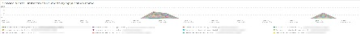
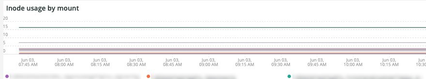
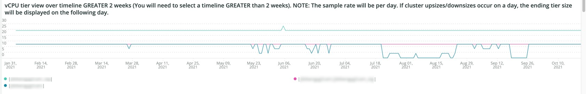
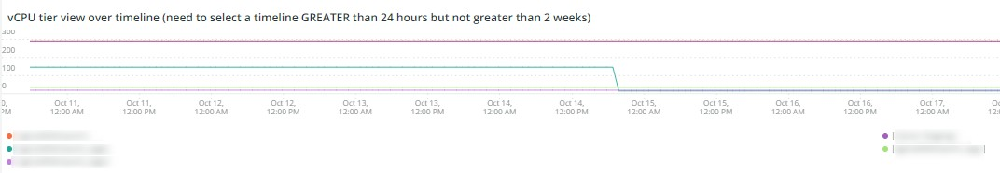
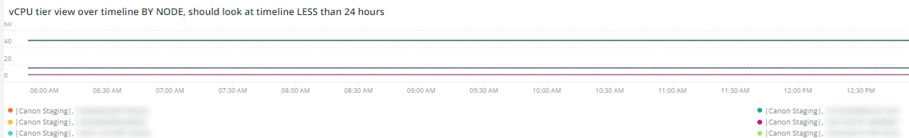
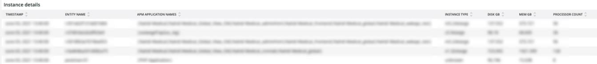
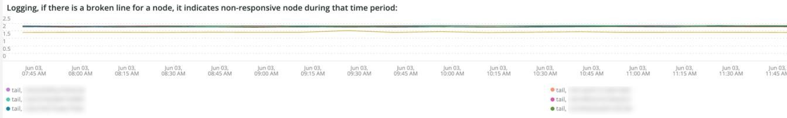

# The [!UICONTROL Infra] tab

The **[!UICONTROL Infra]** tab isolates issues and causes of infrastructure problems. Further are described the frames you can see on the tab.

## [!UICONTROL Service Alerts – Infrastructure Alerts by Application name]

The **[!UICONTROL Service Alerts – Infrastructure Alerts by Application name]** graph shows the service alerts collected by the [!DNL New Relic] infrastructure agent. This will show service restarts, many associated with deployments.

## [!UICONTROL Inode usage by mount]

The **[!UICONTROL Inode usage by mount]** frame shows inode usage by mount across the selected timeframe. Even though there may be plenty of storage free, if a node runs out of inodes, it will show a lack of available storage. Removing files (especially small ones) will free up both space and make inodes available.

## [!UICONTROL vCPU tier view over timeline GREATER 2 weeks]

The **[!UICONTROL vCPU tier view over timeline GREATER 2 weeks]** frame shows vCPU tier view across the selected timeframe of more than two weeks. This frame looks at the number of vCPUs assigned to the [!DNL New Relic] application name shown.

## [!UICONTROL vCPU tier view over timeline]

The **[!UICONTROL vCPU tier view over timeline]** frame shows vCPU tier view across the selected timeframe of more than 24 hours. This frame looks at the number of vCPUs assigned to the [!DNL New Relic] application name shown. It will show both cluster upsizes and downsizes.

## [!UICONTROL vCPU tier view over timeline BY NODE]

The **[!UICONTROL vCPU tier view over timeline BY NODE]** frame shows vCPU tier views across the selected timeframe by node. This frame is helpful in detecting loss of node(s) or when nodes are upsized or downsized. vCPU tier view over timeline BY NODE, should look at timeline LESS than 24 hours.

## [!UICONTROL Instance details]

The **[!UICONTROL Instance details]** table shows instance details of each [!DNL New Relic] application.

## [!UICONTROL Logging, if there is a broken line for a node, it indicates non-responsive node during that time period]

The **[!UICONTROL Logging, if there is a broken line for a node, it indicates non-responsive node during that time period:]** frame shows non-responsive nodes across a time period.
