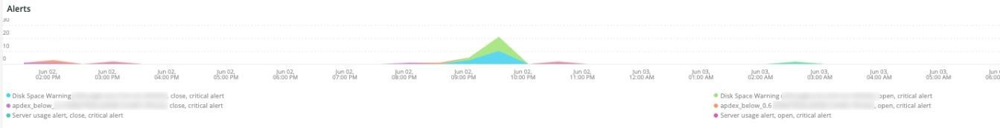
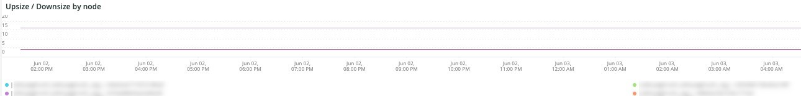
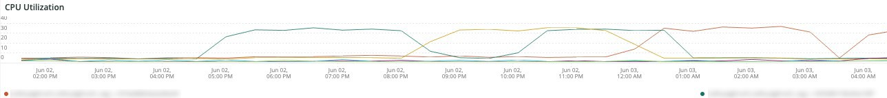

# The [!DNL QuickView] tab

The **[!UICONTROL QuickView]** tab explains the different alert types you may see including those on low disk pace and server usage. Further the frames of the tab are described.

## [!UICONTROL Alerts]

The **[!UICONTROL Alerts]** frame shows different alerts including disk space warnings and server usage alerts across a selected timeframe. This frame looks at database table operations including `SELECT`, `DELETE`, and `UPDATE` across a selected timeframe.

## [!UICONTROL Upsize / Downsize by node]

The **[!UICONTROL Upsize / Downsize by node]** frame shows upsizes and downsizes by node across a selected timeframe. This is used to evaluate whether there was a change in cluster size during the selected time period.

## [!UICONTROL CPU Utilization]

The **[!UICONTROL CPU Utilization]** frame shows CPU utilization by nodes across the selected timeframe.
