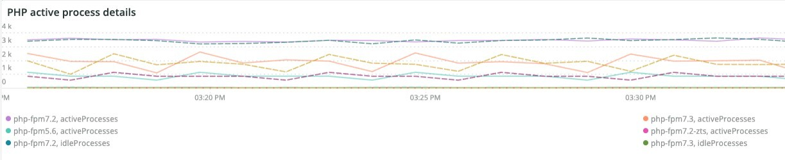
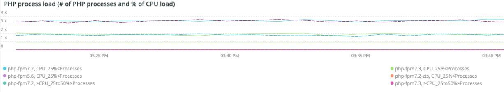
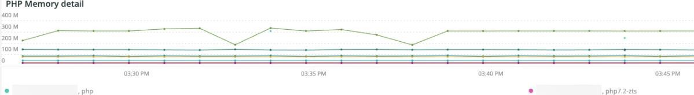
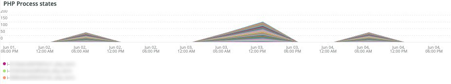
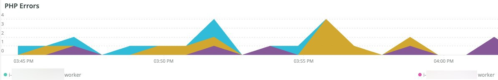
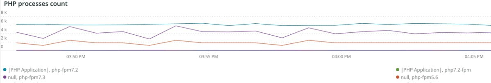
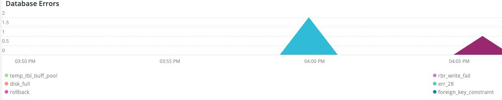
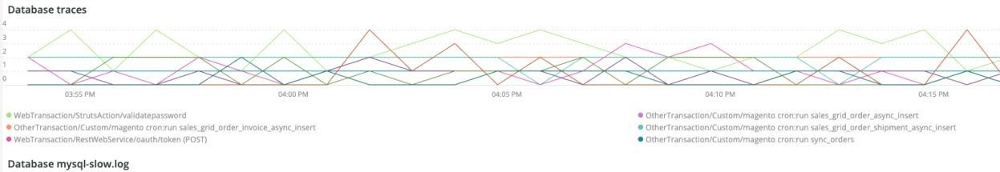
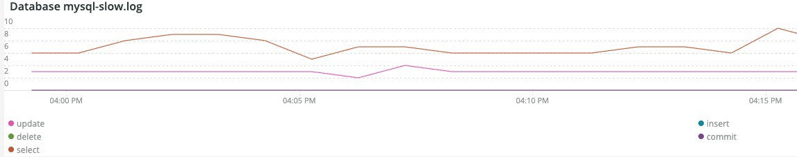

# The [!UICONTROL PHP] tab

The **PHP** tab shows PHP process issues to provide a deeper analysis into PHP problems.

## [!UICONTROL PHP active process details]

The **[!UICONTROL PHP active process details]** frame shows the PHP processes, including php-fpm, across the selected timeframe.

## [!UICONTROL PHP process load (# of PHP processes and % of CPU load)]

The **[!UICONTROL PHP process load (# of PHP processes and % of CPU load)]** frame shows the CPU load from PHP-FPM processes across the selected timeframe.

## [!UICONTROL PHP Memory detail]

The **[!UICONTROL PHP Memory detail]** frame shows the memory usage of PHP processes across the selected timeframe.

## [!UICONTROL PHP CPU Utilization]

The **[!UICONTROL PHP CPU Utilization]** frame shows the CPU percentage utilization of PHP processes across the selected timeframe.

## [!UICONTROL PHP Process states]

The **[!UICONTROL PHP Process states]** frame shows the PHP process states across the selected timeframe. It displays when PHP processes terminate and restart. Beware of terminated PHP processes that do not show restarts.

* '%NOTICE: Terminating ...%') as 'php_term'
* '% NOTICE: exiting, bye-bye!%') as 'php_exit'
* '% NOTICE: fpm is running, pid%') as 'fpm_start'
* '%NOTICE: ready to handle connections%') as 'php_ready'

## [!UICONTROL PHP Errors]

The **[!UICONTROL PHP Errors]** frame shows the number of PHP worker errors across the selected timeframe. Error messages parsed and displayed include:

* '%worker_connections are not enough%') as 'worker'
* '%PHP Fatal error: Allowed memory size!%') as 'mem_size'
* '%exited on signal 11 (SIGSEGV)%') as 'sig_11'
* '%exited on signal 7 (SIGBUS)%') as 'sig_7'
* '%increase pm.start_servers%') as 'pmstart_serv'
* '%max_children%') as 'max_children_cnt'
* '%PHP Fatal error: Allowed memory size of%') as 'mem_exhst_coun'
* '%Unable to allocate memory for pool%') as 'opc_mem_count'
* '%Warning Interned string buffer overflow%') as 'opc_str_buf'
* '%Illegal string offsetl%') as 'opc_sv_comments'
* '%PHP Fatal error: Uncaught RedisException: read error on connection%') as 'php_exc'

## [!UICONTROL PHP processes count]

The **[!UICONTROL PHP processes count]** frame shows a count of PHP processes across the selected timeframe.

## [!UICONTROL Database Errors]

The **[!UICONTROL Database Errors]** frame shows database errors across the selected timeframe. Errors parsed include:

* '%Memory size allocated for the temporary table is more than 20% of innodb_buffer_pool_size%') as 'temp_tbl_buff_pool'
* '%\[ERROR\] WSREP: rbr write fail%') as 'rbr_write_fail'
* '%mysqld: Disk full%') as 'disk_full'
* '%Error number 28%') as 'err_28'
* '%rollback%') as 'rollback'
* '%Foreign key constraint fails for table%') as 'foreign_key_constraint'
* '%Error_code: 1114%') as 'sql_1114_full'
* '%CRITICAL: SQLSTATE[HY000] [2006] MySQL server has gone away%') as 'sql_gone'
* '%SQLSTATE[HY000] [1040] Too many connections%') as 'sql_1040'
* '%CRITICAL: SQLSTATE[HY000] [2002]%') as 'sql_2002'
* '%SQLSTATE[08S01]:%') as 'sql_1047'
* '%[Warning] Aborted connection%') as 'aborted_conn'
* '%SQLSTATE[23000]: Integrity constraint violation:%') as 'sql_23000'
* '%1205 Lock wait timeout%') as 'sql_1205'
* '%SQLSTATE[HY000] [1049] Unknown database%') as 'sql_1049'
* '%SQLSTATE[42S02]: Base table or view not found:%') as 'sql_42S02'
* '%General error: 1114%') as 'sql_1114'
* '%SQLSTATE[40001]%') as 'sql_1213'
* '%SQLSTATE[42S22]: Column not found: 1054 Unknown column%') as 'sq1_1054'
* '%SQLSTATE[42000]: Syntax error or access violation:%') as 'sql_42000'
* '%SQLSTATE[21000]: Cardinality violation:%') as 'sql_1241'
* '%SQLSTATE[22003]:%') as 'sql_22003'
* '%SQLSTATE[HY000] [9000] Client with IP address%') as 'sql_9000'
* '%SQLSTATE[HY000]: General error: 2014%') as 'sql_2014'
* '%1927 Connection was killed%') as 'sql_1927'
* '%1062 \[ERROR\] InnoDB:%') as 'sql_1062_e'
* '%[Note] WSREP: Flushing memory map to disk...%') as 'mem_map_flush'
* '%Internal MariaDB error code: 1146%') as 'sql_1146'
* '%Internal MariaDB error code: 1062%') as 'sql_1062' * '%1062 [Warning] InnoDB:%') as 'sql_1062_w'
* '%Internal MariaDB error code: 1064%') as 'sql_1064'
* '%InnoDB: Assertion failure in file%') as 'assertion_err'
* '%mysqld_safe Number of processes running now: 0%') as 'mysql_oom'
* '%\[ERROR\] mysqld got signal%') as 'mysql_sigterm'
* '%1452 Cannot add%') as 'sql_1452'
* '%ERROR 1698%') as 'sql_1698'
* '%SQLSTATE[HY000]: General error: 3%') as 'cnt_wrt_tmp'
* '%General error: 1 %') as 'sql_syntax'
* '%42S22%') as 'sql_42S22'
* '%InnoDB: Error (Duplicate key)%') as 'innodb_dup_key'

## [!UICONTROL Database traces]

The **[!UICONTROL Database traces]** frame shows database trace information. This frame aligns with the APM transaction summary view for the selected timeline.

## [!UICONTROL Database mysql-slow.log]

The **[!UICONTROL Database mysql-slow.log]** frame shows the query statement types that were in the `mysql-slow.log` file across the selected timeframe.
