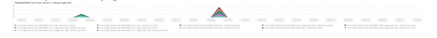

# The [!UICONTROL RabbitMQ] tab

The [!UICONTROL RabbitMQ] tab has information that is focused on RabbitMQ signals.

## [!UICONTROL RabbitMQ Infrastructure events]

The **[!UICONTROL RabbitMQ Infrastructure events]** frame shows Infrastructure events that involve RabbitMQ that occurred across the selected timeframe:

* %Response [error] for node [rabbit@host1]: unexpected http response from%') as 'unexpected_resp_node1'
* '%Response [error] for node [rabbit@host2]: unexpected http response from%') as 'unexpected_resp_node2'
* '%Response [error] for node [rabbit@host3]: unexpected http response from%') as 
'unexpected_resp_node3'
* '%Response [error] for node [rabbit@host3]: Get 
"http://localhost:15672/api/healthchecks/node/rabbit@host3": context deadline exceeded%') 
as 'node3_timeout_exceeded'
* '%Response [error] for node [rabbit@host1]: Get "http://localhost:15672/api/healthchecks/node/rabbit@host1": context deadline exceeded%') as 'node1_timeout_exceeded
* '%Response [error] for node [rabbit@host2]: Get "http://localhost:15672/api/healthchecks/node/rabbit@host2": context deadline exceeded%') as 'node2_timeout_exceeded'
* ‘%401 Unauthorized%') as '401_unauth'
* '%401 Unauthorized%') as '401_unauth'
* %Service restarted: rabbitmq-server%') as 'rmq_service_restart'
* '%Response [failed] for node [rabbit@host1]: nodedown%') as 'rmq_node1_down'
* '%Response [failed] for node [rabbit@host2]: nodedown%') as 'rmq_node2_down'
* '%Response [failed] for node [rabbit@host2]: nodedown%') as 'rmq_node2_down'
* '%Entity modified: exchange/bindings.destination%') as 'rmq_entity_modified'
* '%Entity modified: exchange/bindings.destination%') as 'rmq_entity_modified'
* '%Entity modified: queue/exclusive%') as 'rmq_entity_created_q_exclusive''%Entity modified: queue/auto_delete%') as 'rmq_entity_q_delete' 
* '%Entity modified: queue/durable%') as 'rmq_entity_modified_q_durable'
* '%Entity modified: version/management%') as 'rmq_entity_modified_ver_mgt'
* '%Entity modified: version/management%') as 'rmq_entity_modified_ver_mgt'

## [!UICONTROL RabbitMQ service start/stop signals]

This frame shows RabbitMQ service start/stop signals that occurred during the selected timeframe:

* '%RabbitMQ is asked to stop...%') as 'rabbitmq_stop'
* '%Starting RabbitMQ%') as 'rabbitmq_start'

## [!UICONTROL RabbitMQ errors]

This frame shows RabbitMQ errors that occurred during the selected timeframe:

* '%exit with reason {case_clause,timeout} and stacktrace [{rabbit_mgmt_wm_healthchecks%') as 'exit_timeout'
* '%client unexpectedly closed TCP connection%') as 'client_closed_tcp_conn'
* '%at undefined exit with reason shutdown in context shutdown_error%') as 'undef_exit'
* '%Connection attempt from disallowed node%') as 'disallowed_node'
* '%closing AMQP connection%') as 'rmq_err_amqp_conn'

## [!UICONTROL RabbitMQ node status]

* '%rabbit on node rabbit@host1 down%') as 'rmq_node1_down'
* '%rabbit on node rabbit@host2 down%') as 'rmq_node2_down'
* '%rabbit on node rabbit@host3 down%') as 'rmq_node3_down' 
* '%rabbit on node rabbit@host1 up%') as 'rmq_node1_up'
* '%rabbit on node rabbit@host2 up%') as 'rmq_node2_up'
* '%rabbit on node rabbit@host3 up%') as 'rmq_node3_up'

## [!UICONTROL RabbitMQ Message High-Level Summary status by Queue]

The **[!UICONTROL RabbitMQ Message High-Level Summary status by Queue]** graph shows the number of published messages by the RabbitMQ queue for the selected timeframe.

## [!UICONTROL RabbitMQ Message Detail Summary]

* '%report.ERROR: Cron Job consumers_runner has an error: NOT_FOUND - no queue%') as 'queue_err'
* '%report.ERROR: Cron Job consumers_runner has an error: NOT_FOUND - no queue%') as 'queue_err'
* '%authenticated and granted access to vhost%') as 'auth'
* '%closing AMQP connection%') as 'close_conn'

## [!UICONTROL RabbitMQ Queue Consumption MB]

The **[!UICONTROL RabbitMQ Queue Consumption MB]** graph shows the number of bytes consumed by each RabbitMQ queue over the selected timeframe.

## [!UICONTROL RabbitMQ Published Messages by Queue]

The **[!UICONTROL RabbitMQ Published Messages by Queue]** graph shows the number of bytes consumed by each RabbitMQ queue over the selected timeframe.

## [!UICONTROL RabbitMQ Published Message Throughput by Queue]

The **[!UICONTROL RabbitMQ Published Message Throughput by Queue]** graph shows the average number of published messages per second by each RabbitMQ queue over the selected timeframe.

## [!UICONTROL RabbitMQ Total Message Throughput by Queue]

The **[!UICONTROL RabbitMQ Total Message Throughput by Queue]** graph shows the average total number of messages per second by each 
RabbitMQ queue over the selected timeframe.

## [!UICONTROL RabbitMQ Consumers by Queue]

The **[!UICONTROL RabbitMQ Consumers by Queue]** graph shows the average total number of consumers by each RabbitMQ queue over the selected timeframe.
