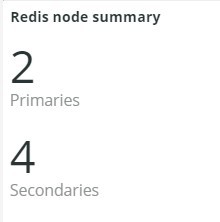
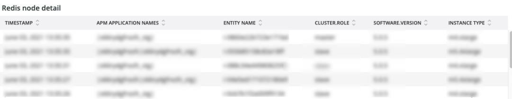
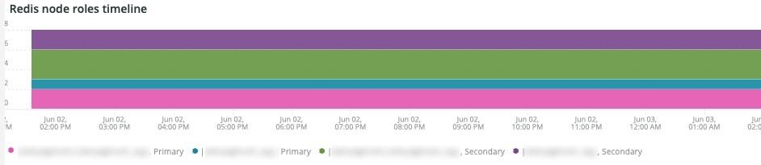
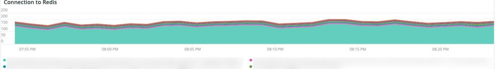
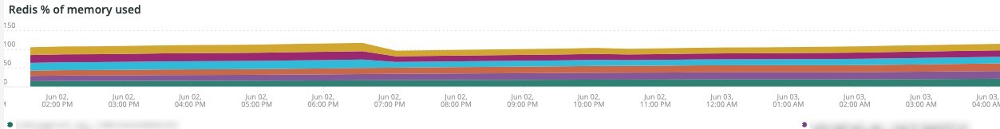
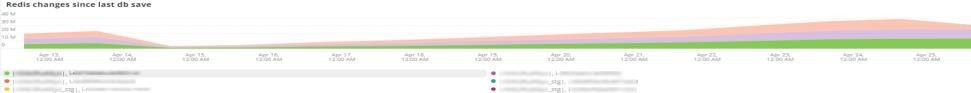
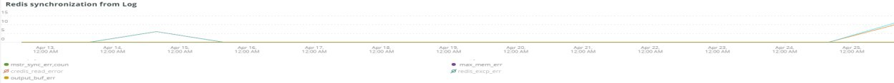

# The [!DNL Redis] tab

## [!UICONTROL Redis Node summary]

This is inclusive of all nodes in an environment. This example includes the nodes for shared staging. There is one primary and two secondaries on production and also a primary and two secondaries on staging.

## [!UICONTROL Redis node detail]

This frame will indicate the environment, [!DNL Redis] role, software version, and node size. 

## [!UICONTROL Redis node roles timeline]

This frame will indicate the loss of [!DNL Redis] service in particular roles. If a line dips, it indicates that the particular role that the line represents has lost a node or nodes. 

## [!UICONTROL Connection to Redis]

This frame displays the net.connectedClients value from the [!DNL New Relic Redis] sample data. It displays the connections count by [!DNL New Relic] application (environment) and node.

## [!UICONTROL Commands per second by node]

This frame will show the [!DNL Redis] commands by node per second over the selected time frame. 

## [!UICONTROL Redis % of memory used]

This frame shows the % of max memory used by the [!DNL Redis] servers.

## [!UICONTROL Redis used memory]

This frame shows the node usage of memory in GB/MB.

## [!UICONTROL Redis changes since last db save]

[!DNL Redis] is a memory resident and saves the information to storage. This frame indicates the number of changes to memory that have occurred since the last database was saved to storage. [This information](https://redis.io/docs/manual/persistence/) explains [!DNL Redis's] persistence. 

## [!UICONTROL Redis synchronization from Log]

This frame focuses on the errors encountered during [!DNL Redis] synchronization or errors that happen due to synchronization problems. See [Redis Documentation](https://redis.io/docs/).
