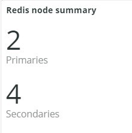
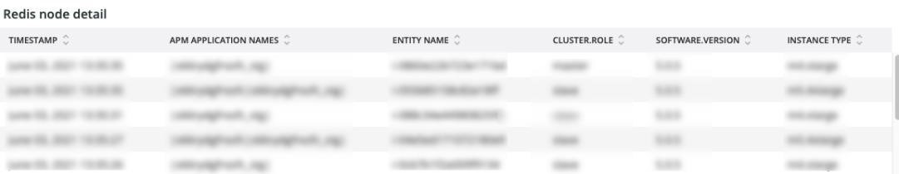
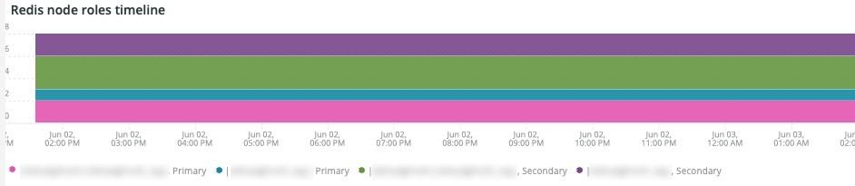
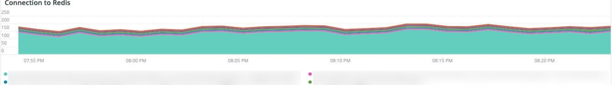
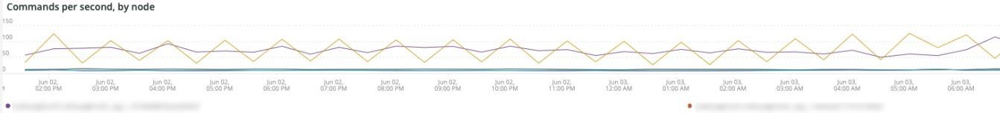
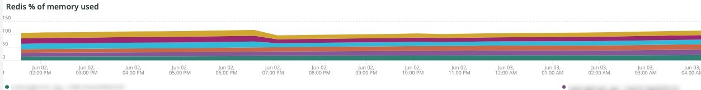
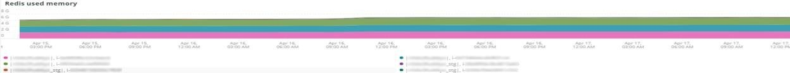
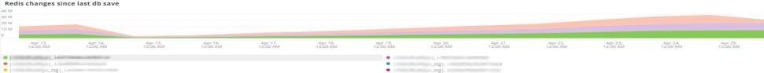
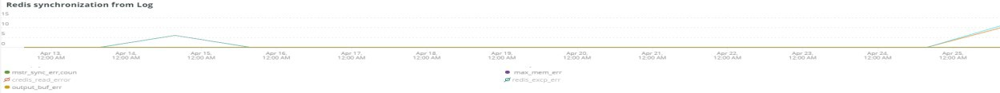

# The [!DNL Redis] tab

## [!UICONTROL Redis Node summary]

The **[!UICONTROL Redis Node summary]** is inclusive of all nodes in an environment. The above example includes the nodes for shared staging. There is one primary and two secondaries on production and also a primary and two secondaries on staging.

## [!UICONTROL Redis node detail]

The **[!UICONTROL Redis node detail]** frame indicates the environment, [!DNL Redis] role, software version, and node size.

## [!UICONTROL Redis node roles timeline]

The **[!UICONTROL Redis node roles timeline]** frame indicates the loss of [!DNL Redis] service in particular roles. If a line dips, it indicates that the particular role that the line represents has lost a node or nodes.

## [!UICONTROL Connection to Redis]

The **[!UICONTROL Connection to Redis]** frame displays the net.connectedClients value from the [!DNL New Relic Redis] sample data. It displays the connections count by [!DNL New Relic] application (environment) and node.

## [!UICONTROL Commands per second by node]

The **[!UICONTROL Commands per second by node]** frame shows the [!DNL Redis] commands by node per second over the selected timeframe.

## [!UICONTROL Redis % of memory used]

The **[!UICONTROL Redis % of memory used]** frame shows the percentage of maximum memory used by the [!DNL Redis] servers.

## [!UICONTROL Redis used memory]

The **[!UICONTROL Redis used memory]** frame shows the node usage of memory in GB/MB.

## [!UICONTROL Redis changes since last db save]

[!DNL Redis] is a memory resident and saves the information to storage. The **[!UICONTROL Redis changes since last db save]** frame indicates the number of changes to memory that have occurred since the last database was saved to storage. Refer to [Redis persistence](https://redis.io/docs/latest/operate/oss_and_stack/management/persistence/) for more explaintion on [!DNL Redis's] persistence.

## [!UICONTROL Redis synchronization from Log]

The **[!UICONTROL Redis synchronization from Log]** frame focuses on the errors encountered during [!DNL Redis] synchronization or errors that happen due to synchronization problems. For more information on [!DNL Redis], refer to [[!DNL Redis] Documentation](https://redis.io/docs/).
