# The [!UICONTROL Security] tab

The **[!UICONTROL Security]** tab explains security issues and isolates their potential causes. Further, the frames of the tab are described.

## [!UICONTROL API calls by IP, details by URL]

The **[!UICONTROL API calls by IP, details by URL]** frame shows a number of API calls by IP across a selected timeframe. This frame displays the IP address and the API URL that was accessed by that IP address.
  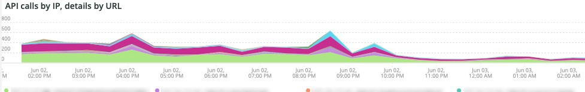

## [!UICONTROL Forgot Password]

The **[!UICONTROL Forgot Password]** access frame shows the number of forgot password attempts across a selected timeframe. High activity against an IP address may be an attack on the site.
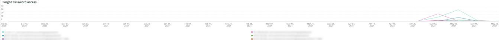

## [!UICONTROL Create Account access]

The **[!UICONTROL Create Account access]** frame shows the number of new account activities across a selected timeframe. High activity from a single IP address can indicate an attack.
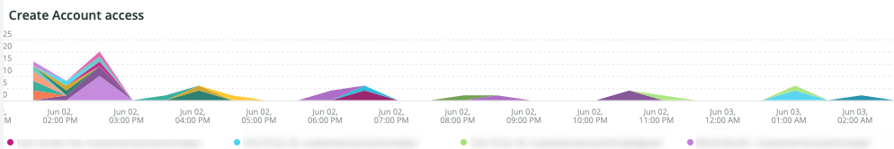

## [!UICONTROL POST activities]

The **[!UICONTROL POST activities]** frame shows the POST activities for the site, faceted on client_ip from the [!DNL Fastly] logs. It also shows the URL that is accessed by the IP address.
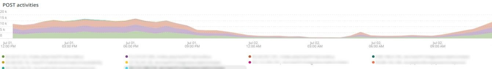

## [!UICONTROL POST activities summary table]

The **POST activities summary table** frame shows the summarized POST activities for the site, faceted on client_ip from the [!DNL Fastly] logs. It also shows the count for the URL that is accessed by the IP address. The count is for the selected timeframe.
  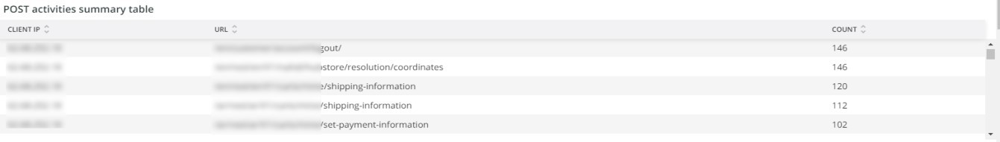

## [!UICONTROL POST activities details table]

The **[!UICONTROL POST activities details table]** frame shows the POST activities for the site from the [!DNL Fastly] logs. It also shows all the details from the [!DNL Fastly] log for these requests. It is limited to the last 2000 requests.
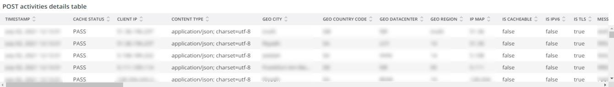

## [!UICONTROL Guest Carts activities]

The **[!UICONTROL Guest Carts activities]** frame shows the number of guest cart activities across a selected timeframe, faceted by IP address and URL accessed. Guest carts may be used in a carding attack. This frame shows the total number of requests where the guest-carts URLs are accessed.
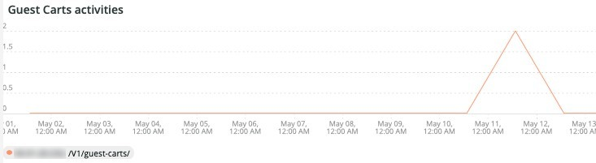

## [!UICONTROL API – forgot password, create account by Countries]

The **[!UICONTROL API – forgot password, create account by Countries]** frame shows the number of accounts created and requests to reset a forgotten password across a selected timeframe. It is faceted to show the country of origin of the request as well. This frame is focused on the country of origin of the request.
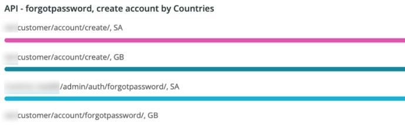

## [!UICONTROL API - forgot password, create account by Countries and IP address]

The **[!UICONTROL API - forgot password, create account by Countries and IP address]** frame shows the number of accounts created and requests to reset a forgotten password across a selected timeframe. It is faceted to show the IP address, URL accessed, and country of origin of the request as well. This frame is focused on the count of IP.
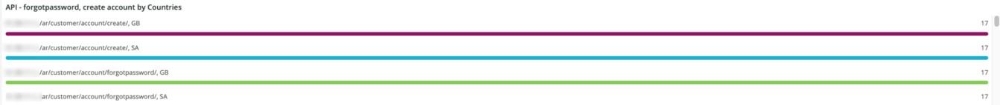

## [!UICONTROL Guest cart activities by IP]

The **[!UICONTROL Guest cart activities by IP]** frame shows guest cart activities by IP across a selected timeframe.
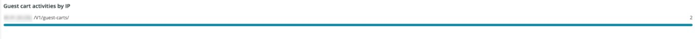

## [!UICONTROL Guest cart activities by Countries]

The **[!UICONTROL Guest cart activities by Countries]** frame shows guest cart activities by countries across a selected timeframe.
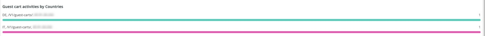
