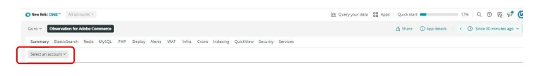
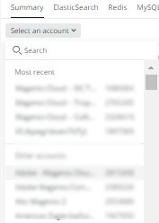

# Selecting the account and timeframe:

When clicking on the [!UICONTROL Observation for Adobe Commerce] icon, the [!DNL Observation for Adobe Commerce] nerdlet will open.

1. Click on the **Select an account** dropdown. If you do not see the **Select an account** dropdown, you may not have access. Request it [here](https://adobe.sharepoint.com/sites/MG/it/IT%20Services%20Wiki/Requesting%20access%20to%20Magento%20Commerce%20New%20Relic.aspx):

    

1. You can paste the project_id, type in the [!DNL New Relic] account number or account name, or browse through the list of accounts.

    

1. Click on the **light blue** (toward the top right of the nerdlet window) dropdown menu with the clock icon.

    

1. You should set the time prior to the ticket date time to see if there were any preceding events/data. You can use the preset timeframes on the left or set a custom timeframe by selecting **Set custom**.
