# The [!UICONTROL Summary] tab

The [!UICONTROL Summary] tab of [!DNL Observation for Adobe Commerce] is intended to quickly see some of the problems experienced by sites to help you auto-resolve or identify potential root causes of site problems. The additional tabs provide deeper level information on component services, database, infrastructure, and process states.

## [!UICONTROL Transaction Overview]

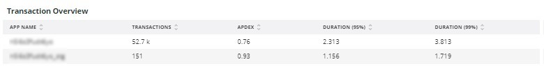

### [What is a transaction?](https://docs.newrelic.com/docs/apm/transactions/intro-transactions/transactions-new-relic-apm/#:%7E:text=transactions%20are%20reported.-,What%20is%20a%20transaction%3F,work%20in%20a%20software%20application.&text=For%20APM%2C%20it%20will%20often,when%20the%20response%20is%20sent)

"At [!DNL New Relic], a transaction is defined as one logical unit of work in a software application. Specifically, it refers to the function calls and method calls that make up that unit of work. It often refers to a web transaction, which represents an activity that happens from when the application receives a web request to when the response is sent."

### Types of transactions:

**Web:** Web transactions are initiated with an HTTP request. For most organizations, these represent customer-centric interactions and thus are the most important transactions to monitor.

**Non-web:** Non-web transactions are not initiated with a web request. They can include non-web worker processes, background processes, scripts, message queue activity, and other tasks.

If you look at the **[!UICONTROL Transaction Overview]** frame above, there were almost 53,000 transactions with an average APDEX score of .76, and 95% of those transactions happened in under 2.313 seconds. This would be a frame where a tighter timeframe may show deviation from that current average if there is an APDEX hit during a short timeframe.

## [!UICONTROL 404 page errors frame]

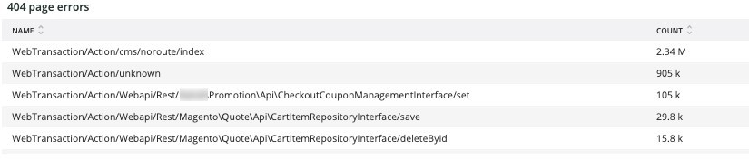

The **[!UICONTROL 404 page errors]** frame lists the [URI](https://en.wikipedia.org/wiki/Uniform_Resource_Identifier) and the count of 404 page errors for a selected timeframe.

## [!UICONTROL % of Storage Free frame]

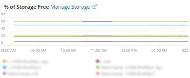

The **[!UICONTROL % of Storage Free]** frame displays the average percent free of the storage mounts across all the nodes of your cluster. For example, if you have a three node cluster, the frame shows the \<mount point\>, \<environment name\>. This frame can be deceptive if there is a variance across three nodes. An example of a variance would be if the `/data/mysql` mount point free was a different value across the three node cluster. There is a frame under the [!UICONTROL MySQL] tab that facets the mount points by node name to see more accurately what the `/data/mysql` storage free on each node actually is.

## [!UICONTROL % of system memory that is free frame]

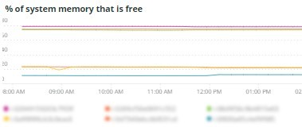

The **% of system memory that is free** frame displays, by node, the amount of system memory that is free on each node.

## [!UICONTROL Swap memory free in bytes]

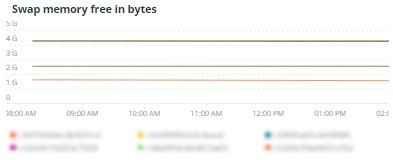

The **[!UICONTROL Swap memory free in bytes]** frame displays, by node, the amount of SWAP memory that is free on the node.

## [!UICONTROL CPU % by host]

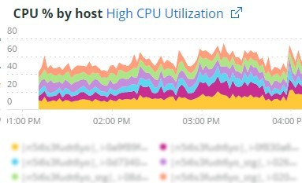

The aggregate of all environments and nodes is displayed in the **[!UICONTROL CPU % by host]** frame. You should deselect the non-production environments. Also note any instances where all nodes for the production environment are not present. For more tips on high CPU utilization, refer to [Troubleshoot performance using New Relic on Adobe Commerce](https://experienceleague.adobe.com/docs/commerce-knowledge-base/kb/troubleshooting/miscellaneous/troubleshoot-performance-using-new-relic-on-magento-commerce.html).

## [!UICONTROL Alerts during timeframe]

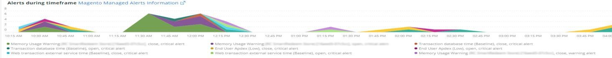

The **[!UICONTROL Alerts during timeframe]** displays all alerts, including the [!UICONTROL Managed Alerts] added by Adobe Commerce support.

## [!UICONTROL CPU Usage]

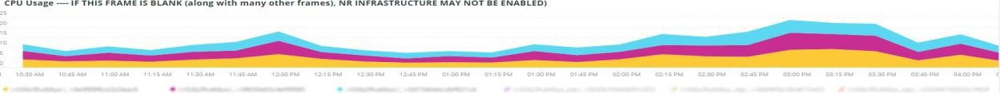

If the **[!UICONTROL CPU Usage]** frame is blank, it is an indication that the infrastructure application of [!DNL New Relic] is not enabled. If your site is on Starter, you do not see this information. If your site is on Pro, open a [support ticket](https://experienceleague.adobe.com/docs/commerce-knowledge-base/kb/help-center-guide/magento-help-center-user-guide.html) to have [!DNL New Relic Infrastructure] enabled for your site.

## [!UICONTROL Average Response Time]

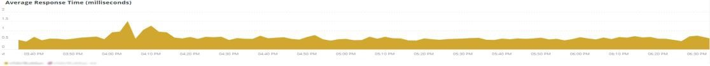

The **[!UICONTROL Average Response Time]** graph shows the average response time for transactions (web and others).

## [!UICONTROL Long duration cron_schedule updates]

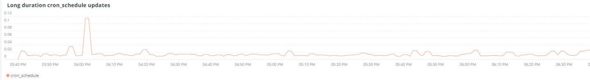

The **[!UICONTROL cron_schedule]** table is written at the start and finish of cron jobs. Long duration cron jobs could indicate latency in updating this table, which can indicate cron stackup or an issue with how crons are scheduled.

## [!UICONTROL Response Code]

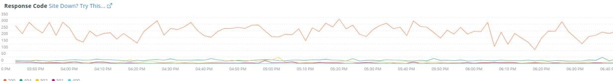

The **[!UICONTROL Response Code]** frame is a good indication of web traffic and the response code of requests. It is [!DNL New Relic's] transaction data, and it is faceted by the `httpResponseCode` returned.

## [!UICONTROL Web Traffic volume compared with one week ago Magento Managed Alerts Information]

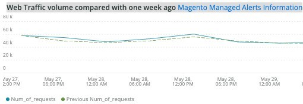

This frame displays the comparative web traffic volume of the past one week and the current week.

## [!UICONTROL Deployment Log Entries]

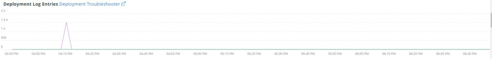

The **[!UICONTROL Deployment Log Entries]** frame displays a count of deployment and cloud log entries and facets the counts by the deployment log name.

## [!UICONTROL Deployment State]

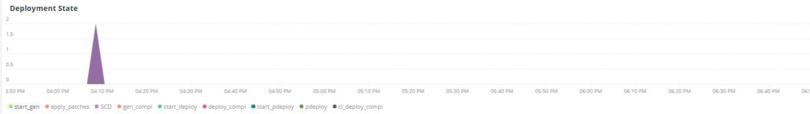

The **[!UICONTROL Deployment State]** frame facets particular deployment phases from the deploy logs. Here are some examples of phases counted in the log and the facet name: 

**Deployment Log Phases:**

* '%Starting generate command%') as 'start_gen'
* '%git apply /app/vendor/magento/ece-tools/patches%') as 'apply_patches'
* '%Set flag: .static_content_deploy%') as 'SCD'
* '%NOTICE: Generate command completed%') as 'gen_compl'
* '%NOTICE: Deployment completed%') as 'deploy_compl'
* '%NOTICE: Starting post-deploy.%') as 'start_pdeploy'
* '%NOTICE: Post-deploy is complete%') as 'pdeploy'
* '%deploy-complete%') as 'cl_deploy_compl'

## [!UICONTROL IP Frequency]

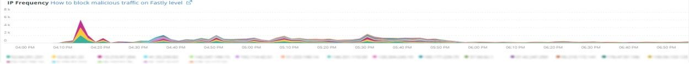

The **[!UICONTROL IP Frequency]** frame counts the ('MISS' and 'PASS') statuses for each IP from the [!DNL Fastly] logs. Web requests with these statuses reach the origin server and will add load to the server. It shows the top twenty addresses in frequency. This frame can be used to detect IP attacks or sources of heavy load on a website.

## [!UICONTROL IP Response – top 20 URLs in duration]

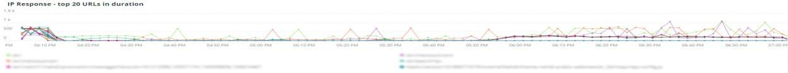

The **[!UICONTROL IP Response – top 20 URLs in duration]** frame displays the URLs with the longest duration in response. It may indicate large image files or pages, API or pages with the longest response duration.

## [!UICONTROL API Calls by IP]

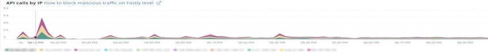

The **[!UICONTROL API Calls by IP]** frame helps identify heavy traffic against the APIs and the IP addresses making requests from the API URLs.

## [!UICONTROL API Calls by IP, details by URL]

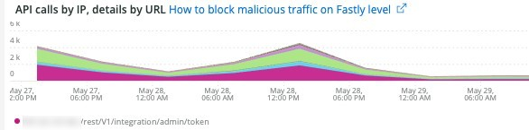

The **[!UICONTROL API Calls by IP, details by URL]** frame provides details of heavy traffic against the APIs and details of the URLs making the requests.

## [!UICONTROL IP Frequency Rate per minute]

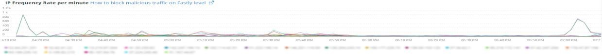

Sometimes it is hard to tell which IP address has the most requests on the other frames. The **[!UICONTROL IP Frequency Rate per minute]** frame shows the rate per minute per IP address.

## [!UICONTROL Potential Bots]

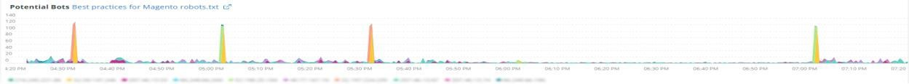

The **[!UICONTROL Potential Bots]** frame looks at requests with a request_user_agent name like NULL or '%bot%'. Typically, the '%bot%' request_user_agent follows the policy setup in `robots.txt` file.

## [!UICONTROL Transaction Errors]

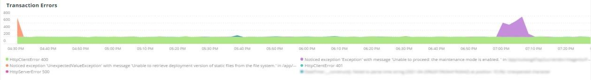

The **[!UICONTROL Transaction Errors]** frame displays the count of transaction errors from [!DNL New Relic].

## [!UICONTROL Nginx access by node]

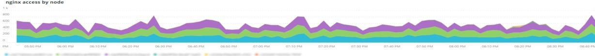

The **[!UICONTROL Nginx access by node]** frame looks at counts from the `access.log` by node. It is helpful to see if the load is evenly distributed. It often shows when a node drops. The frame also shows the load across the site.

## [!UICONTROL Galera Log]

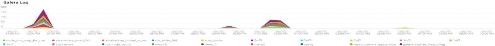

[[!DNL Galera]](https://galeracluster.com/library/galera-documentation.pdf) is used for the database cluster. This frame is focused on particular signals from the [!UICONTROL Galera] cluster. The signals focus on nodes entering and exiting the cluster, which is normal behavior to maintain database data integrity. The nodes are kept synchronized as the [!UICONTROL Galera] cluster state changes.

**List of [!UICONTROL Galera] state changes:**

* '%1047 WSREP has not yet prepared node for application use%') as 'node_not_prep_for_use'
* '%\[ERROR\] WSREP: Failed to read from: wsrep_sst_xtrabackup-v2%') as 'xtrabackup_read_fail'
* '%\[ERROR\] WSREP: Process completed with error: wsrep_sst_xtrabackup-v2 %') as 'xtrabackup_compl_w_err'
* '%\[ERROR\] WSREP: rbr write fail%') as 'rbr_write_fail'
* '%self-leave%') as 'susp_node'
* '%members = 3/3 (joined/total)%') as '3of3'
* '%members = 2/3 (joined/total)%') as '2of3'
* '%members = 2/2%') as '2of2' * '%members = 1/2%') as '1of2' * '%members = 1/3%') as '1of3'
* '%members = 1/1%') as '1of1'
* '%\[Note\] /usr/sbin/mysqld (mysqld 10.%') as 'sql_restart'
* '%Quorum: No node with complete state:%') as 'no_node_count'
* '%WSREP: Member 0%') as 'mem_0'
* '%WSREP: Member 1.0%') as 'mem_1'
* '%WSREP: Member 2%') as 'mem2'
* '%WSREP: Synchronized with group, ready for connections%') as 'ready'
* '%/usr/sbin/mysqld, Version:%') as 'mysql_restart_mysql.slow'
* '%\[Note\] WSREP: New cluster view: global state:%') as 'galera_cluster_view_chng'

These signals may indicate storage, memory, or query issues if the state changes frequently.

## [!UICONTROL Database errors]

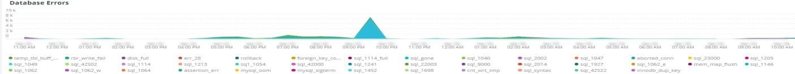

**List of database errors or messages detected:**

* '%Memory size allocated for the temporary table is more than 20% of innodb_buffer_pool_size%') as 'temp_tbl_buff_pool'
* '%\[ERROR\] WSREP: rbr write fail%') as 'rbr_write_fail'
* '%mysqld: Disk full%') as 'disk_full'
* '%Error number 28%') as 'err_28'
* '%rollback%') as 'rollback'
* '%Foreign key constraint fails for table%') as 'foreign_key_constraint'
* '%Error_code: 1114%') as 'sql_1114_full'
* '%CRITICAL: SQLSTATE\[HY000\] \[2006\] MySQL server has gone away%') as 'sql_gone'
* '%SQLSTATE\[HY000\] \[1040\] Too many connections%') as 'sql_1040'
* '%CRITICAL: SQLSTATE\[HY000\] \[2002\]%') as 'sql_2002'
* '%SQLSTATE\[08S01\]:%') as 'sql_1047'
* '%\[Warning\] Aborted connection%') as 'aborted_conn'
* '%SQLSTATE\[23000\]: Integrity constraint violation:%') as 'sql_23000'
* '%1205 Lock wait timeout%') as 'sql_1205'
* '%SQLSTATE\[HY000\] \[1049\] Unknown database%') as 'sql_1049'
* '%SQLSTATE\[42S02\]: Base table or view not found:%') as 'sql_42S02'
* '%General error: 1114%') as 'sql_1114'
* '%SQLSTATE\[40001\]%') as 'sql_1213'
* '%SQLSTATE\[42S22\]: Column not found: 1054 Unknown column%') as 'sq1_1054'
* '%SQLSTATE\[42000\]: Syntax error or access violation:%') as 'sql_42000'
* '%SQLSTATE\[21000\]: Cardinality violation:%') as 'sql_1241'
* '%SQLSTATE\[22003\]:%') as 'sql_22003'
* '%SQLSTATE\[HY000\] \[9000\] Client with IP address%') as 'sql_9000'
* '%SQLSTATE\[HY000\]: General error: 2014%') as 'sql_2014'
* '%1927 Connection was killed%') as 'sql_1927'
* '%1062 \[\ERROR\] InnoDB:%') as 'sql_1062_e'
* '%\[Note\] WSREP: Flushing memory map to disk...%') as 'mem_map_flush'
* '%Internal MariaDB error code: 1146%') as 'sql_1146'
* '%Internal MariaDB error code: 1062%') as 'sql_1062' * '%1062 \[Warning\] InnoDB:%') as 'sql_1062_w'
* '%Internal MariaDB error code: 1064%') as 'sql_1064'
* '%InnoDB: Assertion failure in file%') as 'assertion_err'
* '%mysqld_safe Number of processes running now: 0%') as 'mysql_oom'
* '%\[ERROR\] mysqld got signal%') as 'mysql_sigterm'
* '%1452 Cannot add%') as 'sql_1452'
* '%ERROR 1698%') as 'sql_1698'
* '%SQLSTATE\[HY000\]: General error: 3%') as 'cnt_wrt_tmp'
* '%General error: 1 %') as 'sql_syntax'
* '%42S22%') as 'sql_42S22'
* '%InnoDB: Error (Duplicate key)%') as 'innodb_dup_key'

## [!UICONTROL Database traces]

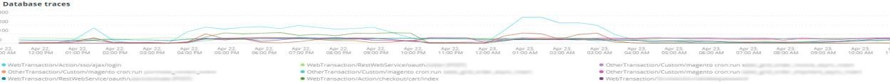

The **[!UICONTROL Database traces]** frame looks at data from the [sql trace](https://docs.newrelic.com/docs/apm/transactions/transaction-traces/transaction-traces-database-queries-page/) entity of [!DNL New Relic] and returns the path of the trace.

## [!UICONTROL Database mysql-slow.log]

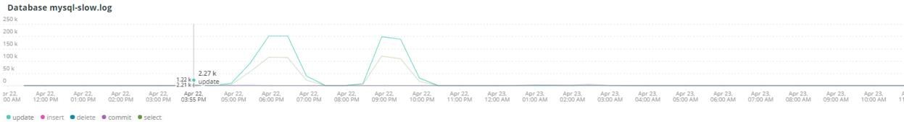

The **[!UICONTROL Database mysql-slow.log]** frame does a count of entries in the [mysql-slow.log](https://dev.mysql.com/doc/refman/5.7/en/slow-query-log.html) by query request type. It isolates timeframes visually that might be of interest in the mysql-slow.log (slow query log). Queries of tables without indices or queries that update large tables may block other queries.

## [!UICONTROL Redis synchronization from Log]

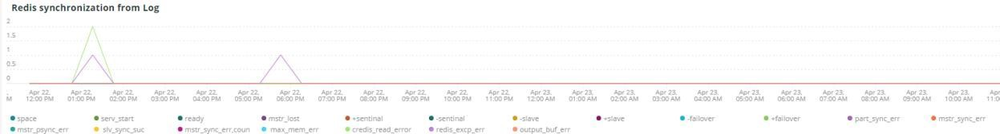

[[!DNL Redis]](https://redis.io/about/) is an open source (BSD licensed) in-memory data structure store used as a database, cache, and message broker. It can do database and session caching if configured. The **[!UICONTROL Redis synchronization from Log]** frame focuses on [[!DNL Redis] synchronization](https://redis.io/docs/latest/operate/oss_and_stack/management/replication/). The larger the [!DNL Redis] dataset, the more likely that there will be problems with the synchronization (more data to keep synchronized).

**[!DNL Redis] errors and messages:**

* '%SLAVE synchronization: No space left on device%') as 'space'
* '%Server started, Redis version%') as 'serv_start'
* '%The server is now ready to accept connections%') as 'ready'
* '%Connection with master lost.%') as 'mstr_lost'
* '%+sdown sentinel%') as '+sentinal'
* '%-sdown sentinel%') as '-sentinal'
* '%-sdown slave%') as '-slave', '%+sdown slave%') as '+slave'
* '%-failover-abort-not-elected master mymaster%') as '-failover'
* '%+failover-abort-not-elected master mymaster%') as '+failover'
* '%Partial resynchronization not possible (no cached master)%') as 'part_sync_err'
* '%MASTER aborted replication with an error: ERR Can%') as 'mstr_sync_err'
* '%Master does not support PSYNC or is in error state%') as 'mstr_psync_err'
* '%SLAVE sync: Finished with success%') as ' slv_sync_suc'
* '%MASTER aborted replication with an error: ERR Can%') as 'mstr_sync_err,coun'
* '%OOM command not allowed when used memory%') as ' max_mem_err'
* '%CredisException(code: 0): read error on connection%') as 'credis_read_error'
* '%Uncaught RedisException:%') as 'redis_excp_err'
* '%psync scheduled to be closed ASAP for overcoming of output buffer%') as 'output_buf_err'

## [!UICONTROL PHP process states]

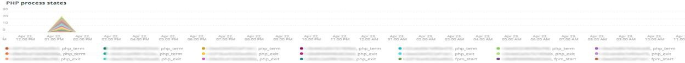

The way PHP process(es) behave depends on the [configuration](https://www.php.net/manual/en/install.fpm.configuration.php). The configuration is complex, with many variables and options. The **[!UICONTROL PHP process states]** frame helps you to understand when PHP processes are terminated and restarted.

### [!UICONTROL PHP errors]

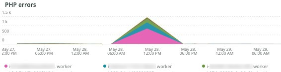

The **[!UICONTROL PHP errors]** frame shows the number of PHP errors with workers across the selected timeframe. For more information, refer to [Adobe Commerce PHP settings](../../installation/prerequisites/php-settings.md).

**PHP errors and messages:**

* '%worker_connections are not enough%') as 'worker'
* '%PHP Fatal error: Allowed memory size!%') as 'mem_size'
* '%exited on signal 11 (SIGSEGV)%') as 'sig_11'
* '%exited on signal 7 (SIGBUS)%') as 'sig_7'
* '%increase pm.start_servers%') as 'pmstart_serv'
* '%max_children%') as 'max_children_cnt'
* '%PHP Fatal error: Allowed memory size of%') as 'mem_exhst_coun'
* '%Unable to allocate memory for pool%') as 'opc_mem_count'
* '%Warning Interned string buffer overflow%') as 'opc_str_buf'
* '%Illegal string offsetl%') as 'opc_sv_comments'
* '%PHP Fatal error: Uncaught RedisException: read error on connection%') as 'php_exc'

## [!UICONTROL PHP processes]

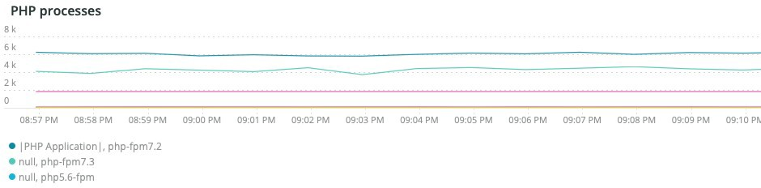

[PHP-FPM](https://php-fpm.org/) is a [!UICONTROL FastCGI Process Manager] used by [!DNL Nginx]. To learn about system requirements, refer to [PHP version requirements mapped to Adobe Commerce versions](../../installation/system-requirements.md). The **[!UICONTROL PHP processes]** frame shows the number of PHP processes running at a particular time in the selected timeline.

## [!UICONTROL Secondary processes]

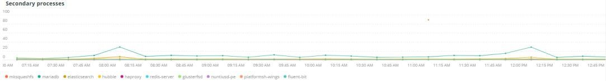

Secondary processes can impact site response. The **[!UICONTROL Secondary processes]** frame indicates a process or processes that may be adding load to the site. The database primarily has the most secondary processes running.

## [!UICONTROL Traffic vs Week Ago]

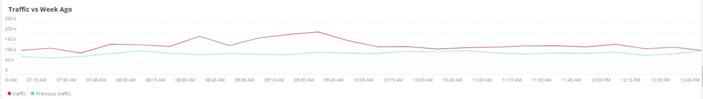

The **[!UICONTROL Traffic vs Week Ago]** frame looks at the website traffic (requests) from the [!DNL Fastly] logs with ('MISS', 'PASS') cache statuses. These requests add load to the origin servers. This frame displays the comparative web request volume of the current week and the past week ago during the same timeframe.

## [!UICONTROL Fastly Cache]

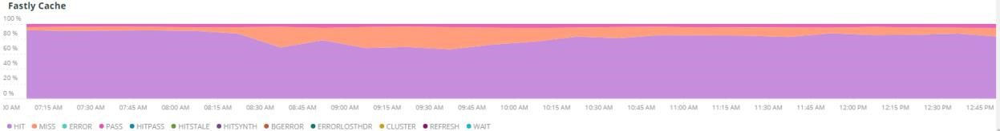

The **[!UICONTROL Fastly Cache]** frame shows an aggregate view of the cache status of requests from the [!DNL Fastly] logs. If you select ERROR, it will show the percent of errors in the requests. This typically increases when the origin server does not respond quickly enough to page requests.

## [!UICONTROL Page Rendering]

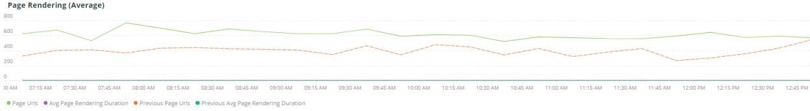

The **[!UICONTROL Page Rendering]** frame displays the current week's average page rendering duration from the page view source of [!DNL New Relic] compared to the prior week during the same time period.

## [!UICONTROL Page loading detail]

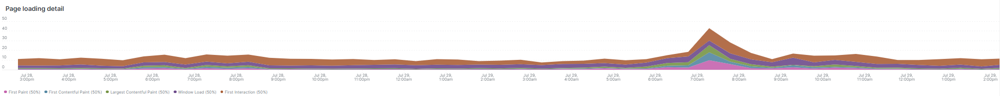

The **[!UICONTROL Page loading detail]** frame describes the page loading events. It details the meanings of these facets. Here is the query that is run for this frame:

`SELECT percentile(timeToResponseStart, 50) AS 'first byte', percentile(firstPaint, 50) as 'First paint', percentile(firstContentfulPaint, 50) as 'First contentful paint', percentile(timeToDomContentLoadedEventEnd, 50) AS 'DOM content loaded', percentile(duration, 50) AS 'Window load + AJAX' FROM BrowserInteraction TIMESERIES`

## [!UICONTROL Transactions – Avg, Max, Min]

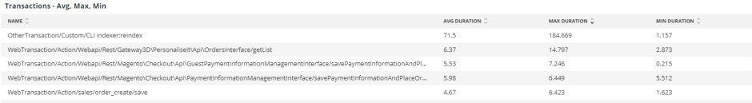

Transaction duration is in seconds. Depending on the transaction, it may impact other transactions if it is long-running. The transactions listed under name and the durations are for the specific time period. If there is a concise issue timeframe, resize the [!DNL Observation for Adobe Commerce] date/time selector to that narrow timeframe.

## [!UICONTROL Admin Activities]

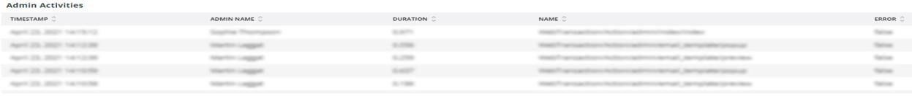

The **[!UICONTROL Admin Activities]** frame identifies transactions with an admin user.

## [!UICONTROL Order transactions (default?)]

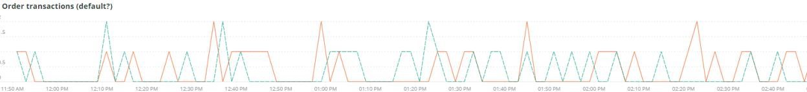

The **[!UICONTROL Order transactions (default?)]** frame looks for transactions `request.headers.host` from transactions, where the name = `WebTransaction/Action/checkout/onepage/success`. If the order success URL is different, this frame will not have data.

## [!UICONTROL Elasticsearch Index information]

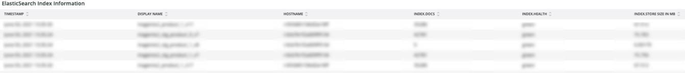

**[Elasticsearch statuses:](https://www.elastic.co/guide/en/elasticsearch/reference/current/cluster-health.html)**

* Green: All shards are assigned.
* Yellow: All primary shards are assigned, but one or more replica shards are unassigned. If a node in the cluster fails, some data could be unavailable until that node is repaired.
* Red: One or more primary shards are unassigned, so some data is unavailable. This can occur briefly during cluster startup as primary shards are assigned.

## [!UICONTROL Elasticsearch Errors]

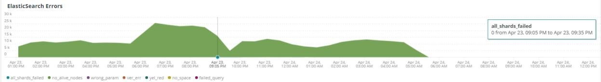

**[!DNL Elasticsearch] errors:**

* '%all shards failed%' as 'all_shards_failed'
* '%NoNodesAvailableException%' as 'no_alive_nodes'
* '%PHP Fatal error: Uncaught Error: Wrong parameters for Elasticsearch%' as 'wrong_param'
* '%You can fix this issue by upgrading the Elasticsearch service on your Magento Cloud infrastructure to version%' as 'ver_err'
* '%cluster health status changed from \[YELLOW\] to \[RED\] (reason:%' as 'yel_red'
* '%No space left on device%' as 'no_space'
* '% Failed to execute &#91;SearchRequest&#123;searchType=%' as 'failed_query'

## [!UICONTROL Cron view]

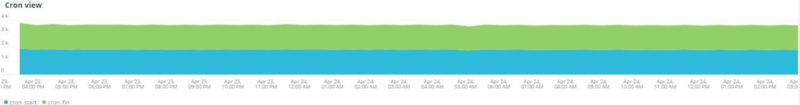

The **[!UICONTROL Cron view]** frame looks at the cron log for balance between the number of crons started versus the number of crons finishing.

## [!UICONTROL Cron error]

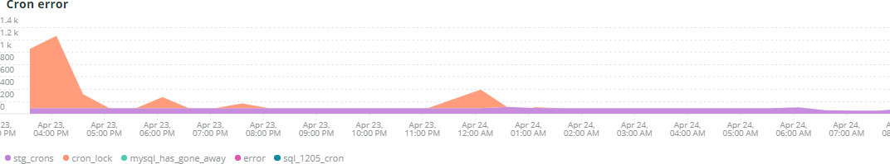

**Cron errors from cron.log:**

* '%_stg%' as 'stg_crons'
* '%Could not acquire lock for cron job%' as 'cron_lock'
* '%General error: 2006 MySQL server has gone away%' as 'mysql_has_gone_away'
* '%error%' as 'error'
* '%General error: 1205 Lock wait timeout exceeded%' as sql_1205_cron

## [!UICONTROL cron_schedule table updates]

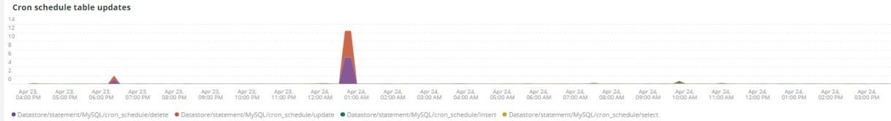

The **[!UICONTROL cron_schedule table updates]** frame looks at maximum duration in seconds where datastore operations updates involve the cron_schedule table. It is faceted on the SQL request type.

## [!UICONTROL Datastore Operations Tables]

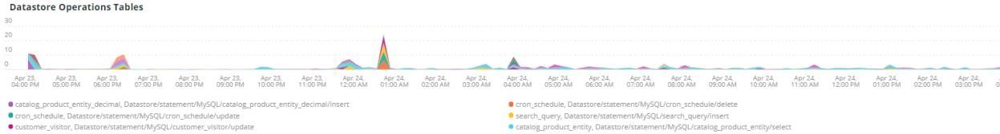

This **[!UICONTROL Datastore Operations Tables]** frame displays the top 25 operations by duration time, table name, and SQL request type. Hover over the spikes to see details of what table was being accessed and by what request type.

## [!UICONTROL Cache Flush]

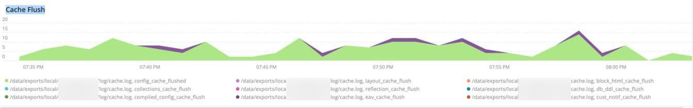

**Cache flushes detected:**

* '%config%' as 'config_cache_flushed'
* '%layout%' as 'layout_cache_flush'
* '%block_html%' as 'block_html_cache_flush'
* '%collections%' as 'collections_cache_flush'
* '%reflection%' as 'reflection_cache_flush'
* '%db_ddl%' as 'db_ddl_cache_flush'
* '%compiled_config%' as 'compiled_config_cache_flush'
* '%eav%' as 'eav_cache_flush'
* '%customer_notification%' as 'cust_notif_cache_flush'
* '%config_integration%' as 'config_integ_cache_flush'
* '%config_integration_api%' as 'config_integ_api_cache_flush'
* '%full_page%' as 'full_page_cache_flush'
* '%config_webservice%' as 'config_webserv_cache_flush'
* '%translate%' as 'translate_cache_flush'
