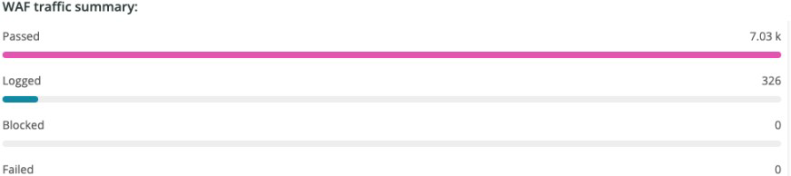
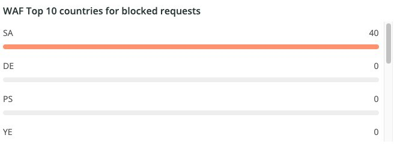
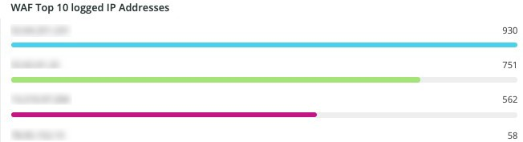
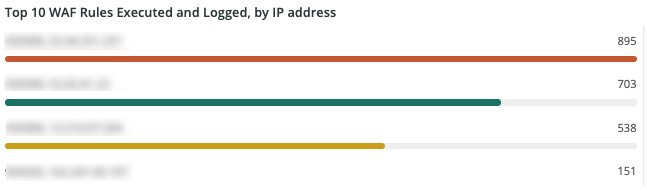

# The [!UICONTROL WAF] tab

This tab shows traffic that is passed and blocked by the firewall.

## [!UICONTROL WAF traffic summary]

This frame shows a count of traffic passed, logged, blocked, and failed by the firewall.

## [!UICONTROL WAF Top 10 blocked IP Addresses]

This frame shows the top 10 most blocked IP addresses by the firewall.

## [!UICONTROL WAF Top 10 countries for blocked requests]

This frame shows a count of blocked requests for countries within the top 10 for blocked requests by the firewall.

## [!UICONTROL WAF Top 10 logged IP Addresses]

This frame shows IP addresses in the top 10 logged IP addresses by the firewall.

## [!UICONTROL Top 10 WAF Rules Executed and Logged by IP address]

This frame shows IP addresses that are in the top 10 most often matching firewall rules.

## [!UICONTROL WAF Logged Details]

This frame shows requests logged by the firewall, including details such as time stamp, city, region, and data center.

## [!UICONTROL WAF Blocked Details]

This frame shows requests blocked by the firewall, including details such as time stamp, city, region, and data center.
