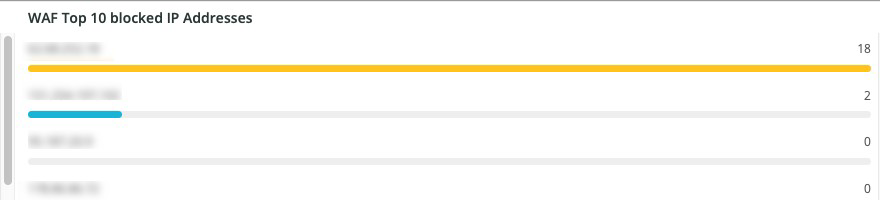
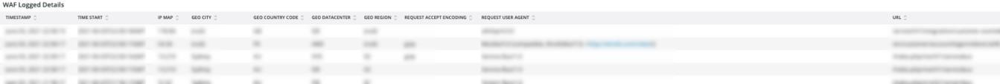
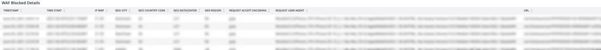

# The WAF tab

This tab shows traffic that is passed and blocked by the firewall.

## WAF traffic summary

This frame shows a count of traffic passed, logged, blocked, and failed by the firewall.

## WAF top 10 blocked IP addresses

This frame shows the top 10 most blocked IP addresses by the firewall.

## WAF top 10 countries for blocked requests

This frame shows a count of blocked requests for countries within the top 10 for blocked requests by the firewall.

## WAF top 10 logged IP addresses

This frame shows IP addresses in the top 10 logged IP addresses by the firewall.

## Top 10 WAF rules executed and logged by IP address

This frame shows IP addresses that are in the top 10 most often matching firewall rules.

## WAF logged details

This frame shows requests logged by the firewall, including details such as time stamp, city, region, and data center.

## WAF blocked details

This frame shows requests blocked by the firewall, including details such as time stamp, city, region, and data center.
