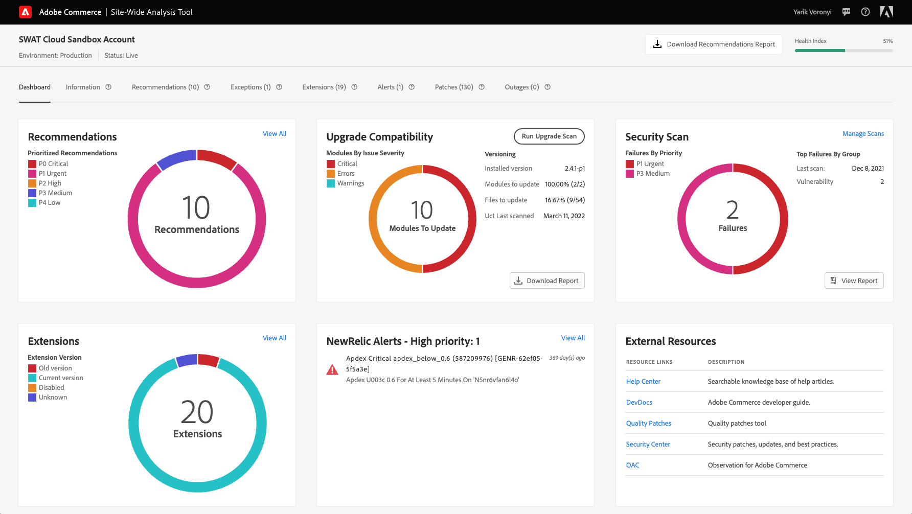
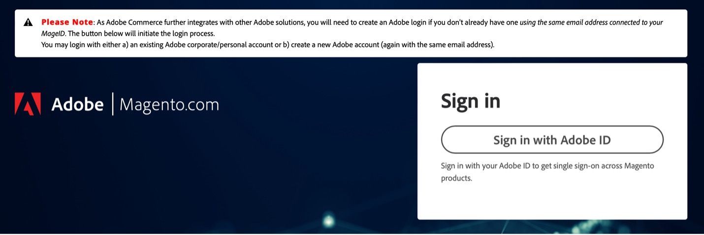
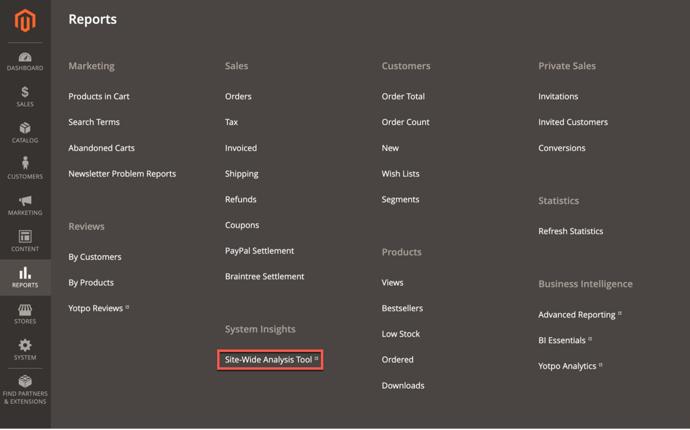

# How to Access the [!DNL Site-Wide Analysis Tool]

There are two ways you can access the [!DNL Site-Wide Analysis Tool Dashboard].

You can access the [!DNL dashboard] from either the [[!DNL Site-Wide Analysis Tool] Website](https://supportinsights.adobe.com/commerce) directly **(for Adobe Commerce on cloud infrastructure only)** and log in with your Adobe ID, or access via the [!DNL dashboard] from your store's [!DNL Admin Panel].  

The [!DNL Site-Wide Analysis Tool] service is available in [production mode](https://experienceleague.adobe.com/en/docs/commerce-admin/systems/tools/developer-tools#operation-modes) for [!DNL Admin] users with permission to access user [role resources](https://experienceleague.adobe.com/en/docs/commerce-admin/systems/user-accounts/permissions-user-roles).

>[!NOTE]
>
>Effective April 23, 2024, the [!DNL Site-Wide Analysis Tool] has been decommissioned and is no longer available for Adobe Commerce on-premises customers.

*[!DNL Site-Wide Analysis Tool] Dashboard*

## Option 1: Logging in to your [!DNL Site-Wide Analysis Tool Dashboard] directly from the [!DNL Site-Wide Analysis Tool] domain (for Adobe Commerce on cloud infrastructure only)

An **[!DNL Adobe ID] is required** to access a [!DNL Commerce] account.
If you already have a [!DNL Commerce] account, but you do not have an [!DNL Adobe ID], you can create one during the sign-in process. 

1. Go to [https://supportinsights.adobe.com/commerce](https://supportinsights.adobe.com/commerce). 

1. Click the **[!UICONTROL Sign in with Adobe ID]** button and follow the prompts.

   
   *[!DNL Adobe ID] login screen*

1. Accept the terms and conditions.

1. **<u>Note</u>:** Your account should be entitled to **[!DNL Support Permissions]** in order to access [!DNL Site-Wide Analysis Tool Dashboard].
See more details in [Share a [!DNL Commerce] account](https://experienceleague.adobe.com/docs/commerce-admin/start/commerce-account/commerce-account-share.html) in our user guide.

## Option 2: Logging in to your [!DNL Site-Wide Analysis Tool Dashboard] from your store's [!DNL Admin Panel]

### Step 1: Verify permissions

Verify that the [!DNL Admin] user account has permission to access the [!DNL Site-Wide Analysis Tool] through their [assigned user role](https://experienceleague.adobe.com/en/docs/commerce-admin/systems/user-accounts/permissions-user-roles).

>[!IMPORTANT]
>
>The [!DNL Site-Wide Analysis Tool] role resource (permission) is **not** auto-assigned. It MUST be activated for the user role and the role individually assigned to each user account in the [!UICONTROL Admin].

For the custom role needing [!DNL Site-Wide Analysis Tool] access, do the following:

1. Select the **[!UICONTROL Reports]** > *[!UICONTROL System Insights]* > **[!UICONTROL Site-Wide Analysis Tool]** role resource.

   
   *[!DNL Site-Wide Analysis Tool] permission selected for the role*

1. Click **[!UICONTROL Save Role]**.

1. Notify any users who are assigned that role to sign out of the [!DNL Admin], and sign in again.

>[!NOTE]
>
>If you have verified that the user account has permission to access the [!DNL Site-Wide Analysis Tool] and the user receives a 403 error when trying to access the tool from the [!DNL Admin], your instance of Adobe Commerce on cloud infrastructure could have HTTP access control enabled. The [!DNL Site-Wide Analysis Tool] Dashboard is NOT supported if you have HTTP Auth enabled. For more information about resolving this issue, see our [Support article](https://support.magento.com/hc/en-us/articles/360057400172-403-errors-when-accessing-Site-Wide-Analysis-Tool-on-Magento?_ga=2.168901729.117144580.1649172612-1623400270.1640858671).

### Step 2: Access [!DNL Site-Wide Analysis Tool]

1. On the *[!UICONTROL Admin]* sidebar, go to **[!UICONTROL Reports]** > *[!UICONTROL System Insights]* > **[!UICONTROL Site-Wide Analysis Tool]**.

   
   *[!DNL Site-Wide Analysis Tool] location in the [!DNL Admin Panel] in Adobe Commerce*

1. Read the *Terms of Use* for the [!DNL Site-Wide Analysis Tool] and click **[!UICONTROL Accept]** to continue.

   Each user is required to accept the Terms of Use for the session. This step is repeated for each logged-in session.

1. At the top of the dashboard, click the tab that you want to see.

   
   *[!DNL Site-Wide Analysis Tool] information*

## Generate reports from the [!DNL Site-Wide Analysis Tool Dashboard]

1. In the upper-right corner of the dashboard, click **[!UICONTROL Generate Report]**.

1. Select the checkbox for each **[!UICONTROL Type]** and **[!UICONTROL Priority]** setting that you want to include in the report.

1. Click **[!UICONTROL Generate Report]**.

   
   *Report Settings*

| TAB | DESCRIPTION |
| --- | --- |
| Dashboard | Shows the health of your system with current notifications and recommendations by priority. |
| Information | Provides customer contact information and a summary of current tickets, with detailed information about each installed Adobe Commerce product. |
| Recommendations | Lists recommendations based on best practices to address issues detected on your site. |
| Exceptions | Lists errors thrown by the application caused by abnormal conditions without an error handler. |
| Extensions | Lists all third-party extensions and third-party libraries. |

>[!NOTE]
>
>After applying a recommendation, it may take a few days for it to be updated in the [!DNL Site-Wide Analysis Tool Dashboard] or generated report.
