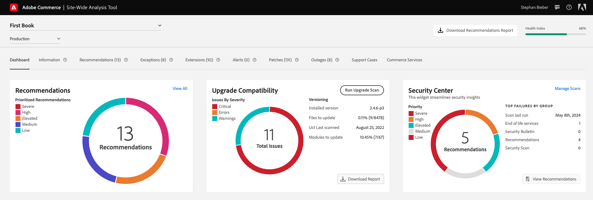

# [!DNL Site-Wide Analysis Tool]

>[!IMPORTANT]
>
>Effective April 23, 2024, the [!DNL Site-Wide Analysis Tool] will be decommissioned for all Adobe Commerce on-premises customers.

This guide provides a holistic overview of the [!DNL Site-Wide Analysis Tool]. It describes the uses, step-by-step instructions for installation, and how to access the tool.

## What is [!DNL Site-Wide Analysis Tool]? 

The [!DNL Site-Wide Analysis Tool] is a proactive self-service tool and central repository that includes detailed system insights and recommendations to ensure the security and operability of your Adobe Commerce installation. It provides 24/7 real-time performance monitoring, reports, and advice to identify potential issues and better visibility into site health, safety, and application configurations. It helps reduce resolution time and improve site stability and performance.

>[!NOTE]
>
>The [!DNL Site-Wide Analysis Tool] reports on system-level data. For reports on Adobe Commerce product, sales, marketing, and other commerce application data, see [Adobe Commerce Reports](https://experienceleague.adobe.com/en/docs/commerce-admin/start/reporting/reports-menu).

{zoomable="yes"}

See this [introduction video](https://www.youtube.com/watch?v=KW2R8ki_RG4) to learn more.

## Tool Overview

- **Dashboard**
    - Shows the overall health of your system with notifications of detected issues and specific recommendations by priority. 
    It also includes a historical chart to track how your website's health changes over time.
    - Shows the **[!UICONTROL Security Center Widget]** that lets you access:
        - [Tech [!DNL Stack] Version Compliance with [!DNL end of life (EOL)]](https://experienceleague.adobe.com/docs/commerce-operations/installation-guide/system-requirements.html)
        - [Adobe Security Bulletin](https://helpx.adobe.com/security/security-bulletin.html)
        - [Recommendations from the [!DNL Security Scan Tool]](https://experienceleague.adobe.com/docs/commerce-admin/systems/security/security-scan.html)
        - [[!DNL Site-Wide Analysis Tool] Best Practice Security Recommendations](https://experienceleague.adobe.com/docs/commerce-operations/tools/site-wide-analysis-tool/recommendations.html)
        
- **Information** - Provides customer contact information and a summary of current tickets, with detailed information about each installed Adobe Commerce product.

- **Recommendations** - Provides a [SWAT Health Index Score](#swat-health-index.md) to track site health and lists recommendations based on best practices to address issues detected on your site:
  - For changes that require an infrastructure update, submit a support request.
  - For changes that require an application update, make the changes yourself. 
  - For changes that require manual intervention such as a [code deployment](https://experienceleague.adobe.com/docs/commerce-cloud-service/user-guide/architecture/pro-develop-deploy-workflow.html#deployment-workflow), ask your system administrator or developers for help.

- **Exceptions** - Lists errors thrown by the application caused by abnormal conditions without an error handler.

- **Extensions** - Lists all third-party extensions and third-party libraries.

- **Patches** - Integrated with the [!DNL Quality Patches Tool], it provides a list of all available patches specific for your Adobe Commerce Instance.

## Integrations with other Adobe Commerce Support Tools

View all of the important insights about your site in one place. [!DNL Site-Wide Analysis Tool] allows you to get direct access to and information from the [!UICONTROL Security Center Widget], [!DNL Upgrade Compatability Tool], and [!DNL Managed Alerts].

- **[!UICONTROL Security Center Widget]** - Displays security insights for your site. 
The security information shown includes [Tech [!DNL Stack] Version Compliance with [!DNL end of life (EOL)]](https://experienceleague.adobe.com/docs/commerce-operations/installation-guide/system-requirements.html), [Adobe Security Bulletin](https://helpx.adobe.com/security/security-bulletin.html), [Recommendations from the [!DNL Security Scan Tool]](https://experienceleague.adobe.com/docs/commerce-admin/systems/security/security-scan.html), and [[!DNL Site-Wide Analysis Tool] Best Practice Security Recommendations](https://experienceleague.adobe.com/docs/commerce-operations/tools/site-wide-analysis-tool/recommendations.html). 
The [[!DNL Security Scan Tool]](https://experienceleague.adobe.com/docs/commerce-admin/systems/security/security-scan.html) provides Adobe Commerce and Magento Open-Source customers with real-time insights into the security status of their store by proactively detecting malware and notifying them if their store is compromised.

- [**[!DNL Upgrade Compatability Tool]**](../../upgrade/upgrade-compatibility-tool/overview.md) - Runs Adobe Commerce's customized instance against the target upgrade version and returns a summary of critical issues, errors, and warnings that must be addressed, making the upgrade analysis process easier, faster, and cheaper.

- [**[!DNL Managed Alerts]**](https://support.magento.com/hc/en-us/sections/360010758472-Managed-alerts-for-Adobe-Commerce) - Monitor multiple metrics to proactively track the platform's performance and provide specific instructions on how to troubleshoot issues so that merchants can avoid critical downtime and stay informed about their CPU, application performance, disk, memory, and database.

## Who is this guide for?

Merchants and partners who want to have greater visibility into their Adobe Commerce websites. It empowers merchants to improve their customers' experience and have closer alignment on the best practices recommendations and foundational issues.

## [!DNL Site-Wide Analysis Tool] demo

Watch this video to learn about the [!DNL Site-Wide Analysis Tool]:

>[!VIDEO](https://video.tv.adobe.com/v/344001?quality=12)
