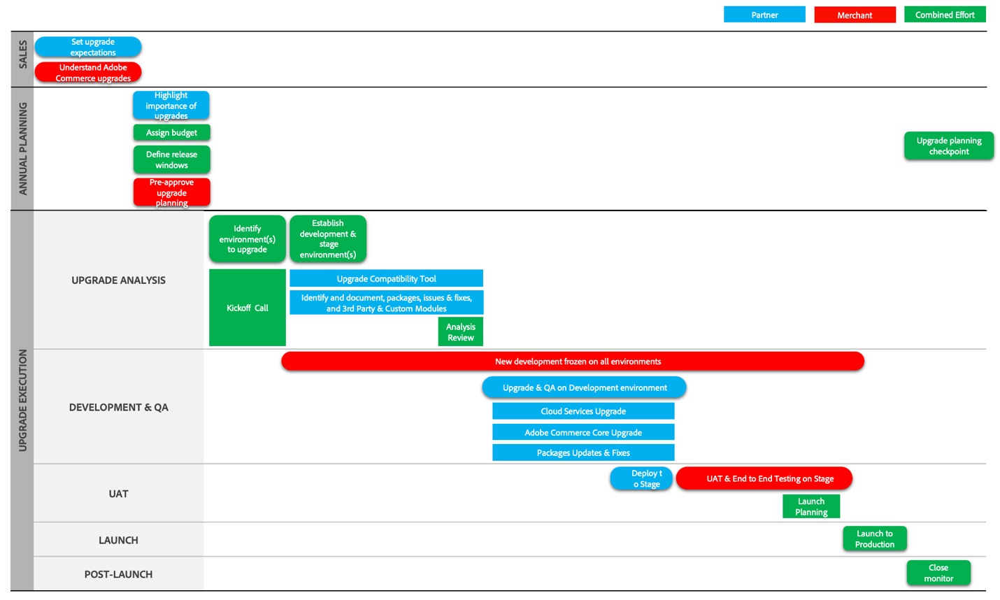

# Upgrade journey phases

Upgrades require close attention, planning, and management. To help you understand the upgrade journey for Adobe Commerce and Magento Open Source, we describe the process in three main phases: 

- [Project launch](project-launch.md)
- [Annual planning](annual-planning.md)
- [Implementation](implementation.md)

