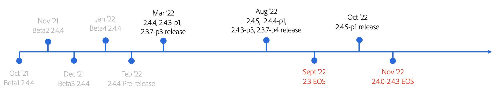

# Overview of the upgrade process

Upgrading your Adobe Commerce or Magento Open Source project is critical to ensuring that your store stays secure, PCI-compliant, and operating at peak efficiency. We’ve developed this guide to walk you through the key considerations when preparing for an upgrade.

The guide provides an overview of the typical Adobe Commerce/Magento Open Source upgrade journey and best practices to follow along that journey. It also describes technical details of the upgrade process with a timely example and  step-by-step instructions for upgrading to Adobe Commerce/Magento Open Source version 2.4.4. The 2.4.4 patch release will be generally available on March 8, 2022, so it’s important to start preparing for this upgrade early because the [End-of-Life (EOL)](https://devdocs.magento.com/release/lifecycle-policy.html) dates are approaching for both the 2.3 line and versions 2.4.0 to 2.4.3 in 2022. Finally, we provide planning resources and upgrade tools that make your upgrade process more efficient.

## Who is this guide for?

The target audience for this guide includes:

### Ecommerce Managers and Technical Directors

This guide helps customers in these roles understand the upgrade journey, the importance of upgrading regularly, and how to best plan and prepare for an upgrade.

### Operations and Development Teams

This guide helps these teams learn the technical steps required to upgrade to 2.4.4 (or any version of Adobe Commerce/Magento Open Source) and the tools that they can use to make the process easier, faster, and more affordable.

## Upgrade process explained

One of the reasons you chose Adobe Commerce/Magento Open Source likely includes: 

- Broad out-of-the-box feature set
- SaaS features offered separate from the core code
- Robust offering of Marketplace extensions
- Unique ability to allow for infinite flexibility so that you can customize your site to best serve your business’ and customers’ needs.

The benefit of being a highly extensible and customizable product, however, can spur potential upgrade issues when customizations are not coded to best practices, leading to higher-than-expected upgrade costs.

_So... why upgrade at all?_

Upgrading empowers your business to stay nimble in the fast-paced and ever-changing eCommerce industry and enables your platform to be always-compatible with the latest features that help maximize sales and conversions. Including upgrades in your regular maintenance plans is also critical to ensuring that your store stays secure, PCI-compliant, and operating at peak efficiency.

### Security

Security is one of the top reasons for upgrading as 83% of security incidents occur on outdated software. According to [IBM](https://www.ibm.com/security/data-breach), the average cost of a data breach is $3.86 million—far greater than what it costs to mitigate this risk through upgrading. Adobe offers two ways to keep your store secure throughout the year: 

- **Patch releases**—Include security, performance, quality, and high-priority bug fixes.
- **Security patch releases**—Include fixes and enhancements to keep your site secure and are easier to implement.

### Performance

Performance is another top reason for upgrading. According to [HubSpot](https://blog.hubspot.com/marketing/page-load-time-conversion-rates), the first five seconds of load time have a significant effect on conversion rates and every second of latency thereafter has a –4.4% impact. That, coupled with the fact that page speed is a leading SEO ranking factor, demonstrates why site performance is a critical element of your site to maintain and regularly improve upon. Each patch release includes performance improvements, so taking advantage of new releases supports your growth plans and keeps your business competitive.

### Cost of delay

The case for delaying or deferring platform upgrades often comes down to the immediate cost. However, the real cost of running an outdated version of any software is much larger and can have a lasting impact on a business.

It may seem counterintuitive, but performing regular platform updates requires less overall effort than performing infrequent updates due to the amount of accumulated technical debt that results from delaying. We recently worked with a partner who has a retail merchant that used to conduct upgrades infrequently and inconsistently (annually or longer). By transforming how they approach upgrades and following an Adobe-recommended regular upgrade path over the course of 12 months, the partner was able to save the client four weeks' worth of cumulative development time, effort, and associated costs, all of which were redirected to initiatives that drive business growth.
 
When updates are performed regularly, changes are incremental and the corresponding upgrade effort reflects this. When platform updates are deferred for an extended period, they can become a much more involved process. Furthermore, the extensions you use from the [Marketplace](https://marketplace.magento.com/) and any other third-party integrations may also be impacted. Lastly, the time it takes to investigate, plan, and perform a delayed upgrade are all extended, which adds avoidable effort and costs.

Some of the general factors that affect the level of effort to upgrade your project include, but are not limited to:

| Technical complexity                                      | Planning and strategy                                        |
|-----------------------------------------------------------|--------------------------------------------------------------|
| Extent of customizations                                  | Clarity of requirements, wavering decisions, and scope creep |
| Number of extensions                                      | Your upgrade frequency                                       |
| Number of integrations with third-parties (OMS, ERP)      | Your testing strategy                                        |
| Coding to best practices                                  |                                                              |

Continued growth in the digital commerce space has applied increased pressure on businesses to evolve faster, more often, and in unpredictable ways. Failure to keep up and anticipate customer purchasing behavior has leveled the playing field for even the biggest, most established brands. You must be able to provide robust, personalized experiences across all touchpoints, with no lapses in performance and uptime. You must be able to innovate faster, without limits, to stay ahead of global competitors. By upgrading, you’re future proofing your business and setting yourself up to better service dynamic customer needs.

## 2022 release schedule

Adobe publishes a [release schedule](https://devdocs.magento.com/release/) annually to facilitate merchants’ planning process and recommends upgrading each patch release cycle. To remain PCI-compliant, merchants must be on the latest patch or security patch. The following timeline shows the major release and EOL events in 2022.

 
Important events to note include:

- 2.3.x line reaches End of Support (EOS) in September 2022
- 2.4.0 to 2.4.3 (based on PHP 7.4) reaches EOS in November 2022, when PHP 7.4 reaches End of Life (EOL)
- Based on these two EOS events, **it is important to upgrade to version 2.4.4 or higher by November 2022** 
- In line with the Adobe Commerce [lifecycle policy](https://devdocs.magento.com/release/lifecycle-policy.html), versions 2.4.4 and 2.4.5 will receive quality support and security patches until Nov 2024
