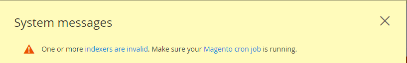
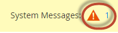

# Complete upgrade prerequisites

It is important to understand what is necessary to run Adobe Commerce or Magento Open Source. You must first review the [system requirements](https://devdocs.magento.com/guides/v2.4/install-gde/system-requirements.html) for the version you are planning to upgrade to.

After reviewing system requirements, you must complete the following prerequisites before upgrading your system:

- Update all software
- Verify that Elasticsearch is installed
- Set the open files limit
- Verify that cron jobs are running
- Set `DATA_CONVERTER_BATCH_SIZE`
- Verify file system permissions
- Set the `pub/` directory root
- Install the Composer update plugin

## Update all software

The [system requirements](https://devdocs.magento.com/guides/v2.4/install-gde/system-requirements.html) describe exactly which versions of third-party software have been tested with Adobe Commerce and Magento Open Source releases.

Ensure that you updated all system requirements and dependencies in your environment. See PHP [7.4](https://www.php.net/manual/en/migration74.php), PHP [8.0](https://www.php.net/manual/en/migration80.php), PHP [8.1](https://www.php.net/manual/en/migration81.php), and [required PHP settings](https://devdocs.magento.com/guides/v2.4/install-gde/prereq/php-settings.html#php-required-set).

## Verify Elasticsearch is installed

Adobe Commerce and Magento Open Source require Elasticsearch to be installed in order to use the software. Before you upgrade from 2.3.x to 2.4, you must check whether you are using MySQL, Elasticsearch, or a third-party extension as your catalog search engine in your 2.3.x instance. The result determines what you must do _before_ upgrading to 2.4.

You can use the command line or the Admin to determine your catalog search engine:

- Enter the `bin/magento config:show catalog/search/engine` command. The command returns a value of `mysql`, `elasticsearch` (which indicates Elasticsearch 2 is configured), `elasticsearch5`, `elasticsearch6`, `elasticsearch7`, or a custom value, indicating you have installed a third-party search engine.

- From the Admin, check the value of the **[!UICONTROL Stores]** > [!UICONTROL Settings] > **[!UICONTROL Configuration]** > **[!UICONTROL Catalog]** > **[!UICONTROL Catalog]** > **[!UICONTROL Catalog Search]** > **[!UICONTROL Search Engine]** field.

The following sections describe what actions you must take before upgrading to 2.4.0.

### MySQL

As of 2.4, MySQL is no longer a supported catalog search engine. You must install and configure Elasticsearch before upgrading. Use the following resources to help guide you through this process:

- [Install and configure Elasticsearch](https://devdocs.magento.com/guides/v2.4/config-guide/elasticsearch/es-overview.html)
- [Installing Elasticsearch](https://www.elastic.co/guide/en/elasticsearch/reference/current/install-elasticsearch.html)
- Configure Elasticsearch to work with [nginx](https://devdocs.magento.com/guides/v2.4/config-guide/elasticsearch/es-config-nginx.html) or [Apache](https://devdocs.magento.com/guides/v2.4/config-guide/elasticsearch/es-config-apache.html)
- [Configure Commerce to use Elasticsearch](https://devdocs.magento.com/guides/v2.4/config-guide/elasticsearch/configure-magento.html) and reindex

Some third-party catalog search engines run on top of the Adobe Commerce search engine. Contact your vendor to determine whether you must update your extension.

### Elasticsearch

You must install and configure Elasticsearch before upgrading to 2.4.0. Adobe no longer supports Elasticsearch 2.x, 5.x, and 6.x.

Refer to [Upgrading Elasticsearch](https://www.elastic.co/guide/en/elasticsearch/reference/current/setup-upgrade.html) for full instructions on backing up your data, detecting potential migration issues, and testing upgrades before deploying to production. Depending on your current version of Elasticsearch, a full cluster restart may or may not be required.

Elasticsearch requires JDK 1.8 or higher. See [Install the Java Software Development Kit (JDK)](https://devdocs.magento.com/guides/v2.4/install-gde/prereq/elasticsearch.html#prereq-java) to check which version of JDK is installed.

[Configure Magento to use Elasticsearch](https://devdocs.magento.com/guides/v2.4/config-guide/elasticsearch/configure-magento.html) describes the tasks you must perform after updating Elasticsearch 2 to a supported version.

### Third-party extensions

We recommend that you contact your search engine vendor to determine whether your extension is fully compatible with 2.4.

## Set the open files limit

Setting the open files limit (ulimit) can help avoid failure from multiple recursive calls of long query strings or issues with using the `bin/magento setup:rollback` command. This command is different for different UNIX shells. Consult your individual flavor for specifics about the `ulimit` command.  

Adobe recommends setting the open files [ulimit](http://ss64.com/bash/ulimit.html) to a value of `65536` or more, but you can use a larger value if necessary. You can set the ulimit on the command line or you can make it a permanent setting for the user's shell.

To set the ulimit from the command line:

1. Switch to the [file system owner](https://devdocs.magento.com/guides/v2.4/install-gde/prereq/file-sys-perms-over.html).
1. Set the ulimit to 65536.

   ```bash
   ulimit -s 65536
   ```

   >[!NOTE]
   >
   > The syntax for open files ulimit depends on the UNIX shell you use. The preceding setting should work with CentOS and Ubuntu with the Bash shell. However, for Mac OS, the correct setting is ulimit -S 65532. Consult a man page or operating system reference for more information.

To set the value in your Bash shell:

1. Switch to the [file system owner](https://devdocs.magento.com/guides/v2.4/install-gde/prereq/file-sys-perms-over.html).
1. Open `/home/<username>/.bashrc` in a text editor.
1. Add the following line:

   ```bash
   ulimit -s 65536
   ```

1. Save your changes to the `.bashrc` file and exit the text editor.

>[!IMPORTANT]
>
>We recommend that you avoid setting a value for the `pcre.recursion_limit` property in the `php.ini` file because it can result in incomplete rollbacks with no failure notice.

## Verify cron jobs are running

The UNIX task scheduler `cron` is critical to day-to-day Adobe Commerce and Magento Open Source operations. It schedules things like reindexing, newsletters, e-mails, sitemaps, and so on. Several features require at least one cron job running as the file system owner.

To verify that your cron job is set up properly, check the crontab by entering the following command as the file system owner:

>[!NOTE]
>
>The crontab is the configuration file responsible for running cron jobs.

```bash
crontab -l
```

Results similar to the following should display:

```cron
#~ MAGENTO START c5f9e5ed71cceaabc4d4fd9b3e827a2b
* * * * * /usr/bin/php /var/www/html/magento2/bin/magento cron:run 2>&1 | grep -v "Ran jobs by schedule" >> /var/www/html/magento2/var/log/magento.cron.log
#~ MAGENTO END c5f9e5ed71cceaabc4d4fd9b3e827a2b
```

Another symptom of cron not running is the following error in the Admin:



To see the error, click **System Messages** at the top of the window as follows:



See [Configure and run cron](https://devdocs.magento.com/guides/v2.4/config-guide/cli/config-cli-subcommands-cron.html) for more infromation.

## Set DATA_CONVERTER_BATCH_SIZE

Adobe Commerce 2.4 includes security enhancements that require some data to be converted from serialized to JSON. This conversion occurs during the upgrade and it can take a long time, depending on how much data is in your database.

The following tables are affected the most:

- `catalogrule`
- `core_config_data`
- `magento_reward_history`
- `quote_payment`
- `quote`
- `sales_order_payment`
- `sales_order`
- `salesrule`
- `url_rewrite`

If you have a large amount of data, you can improve performance by setting the value of an environment variable, `DATA_CONVERTER_BATCH_SIZE`. By default, the value is set to `50,000`.

To set the environment variable:

1. Switch to the [file system owner](https://devdocs.magento.com/guides/v2.4/install-gde/prereq/file-sys-perms-over.html).
1. Set the variable:

   ```bash
   export DATA_CONVERTER_BATCH_SIZE 100000
   ```

   >[!NOTE]
   >
   > `DATA_CONVERTER_BATCH_SIZE` requires memory; avoid setting it to a large value (approximately 1GB) without testing it first.

1. After your upgrade is complete, you can unset the variable:

   ```bash
   unset DATA_CONVERTER_BATCH_SIZE
   ```

## Verify file system permissions

For security reasons, Adobe Commerce and Magento Open Source require certain permissions on the file system. Permissions are different from _[ownership](https://devdocs.magento.com/guides/v2.4/comp-mgr/prereq/prereq_compman-checklist.html#magento-owner-group)_. Ownership determines who can perform actions on the file system; permissions determine what the user can do.

Directories in the file system must be writable by the [file system owner’s](https://devdocs.magento.com/guides/v2.4/install-gde/prereq/file-sys-perms-over.html) group.

To verify that your file system permissions are set properly, either log in to the application server or use your hosting provider’s file manager application.

For example, enter the following command if the application is installed in `/var/www/html/magento2`:

```bash
ls -l /var/www/html/magento2
```

Sample output:

```console
total 1028
drwxrwx---. 12 magento_user apache   4096 Jun  7 07:55 .
drwxr-xr-x.  3 root         root     4096 May 11 14:29 ..
drwxrwx---.  4 magento_user apache   4096 Jun  7 07:53 app
drwxrwx---.  2 magento_user apache   4096 Jun  7 07:53 bin
-rw-rw----.  1 magento_user apache 439792 Apr 27 21:23 CHANGELOG.md
-rw-rw----.  1 magento_user apache   3422 Apr 27 21:23 composer.json
-rw-rw----.  1 magento_user apache 425214 Apr 27 21:27 composer.lock
-rw-rw----.  1 magento_user apache   3425 Apr 27 21:23 CONTRIBUTING.md
-rw-rw----.  1 magento_user apache  10011 Apr 27 21:23 CONTRIBUTOR_LICENSE_AGREEMENT.html
-rw-rw----.  1 magento_user apache    631 Apr 27 21:23 COPYING.txt
drwxrwx---.  4 magento_user apache   4096 Jun  7 07:53 dev
-rw-rw----.  1 magento_user apache   2926 Apr 27 21:23 Gruntfile.js
-rw-rw----.  1 magento_user apache   7592 Apr 27 21:23 .htaccess
-rw-rw----.  1 magento_user apache   6419 Apr 27 21:23 .htaccess.sample
drwxrwx---.  4 magento_user apache   4096 Jun  7 07:53 lib
-rw-rw----.  1 magento_user apache  10376 Apr 27 21:23 LICENSE_AFL.txt
-rw-rw----.  1 magento_user apache  30634 Apr 27 21:23 LICENSE_EE.txt
-rw-rw----.  1 magento_user apache  10364 Apr 27 21:23 LICENSE.txt
-rw-rw----.  1 magento_user apache   4108 Apr 27 21:23 nginx.conf.sample
-rw-rw----.  1 magento_user apache   1427 Apr 27 21:23 package.json
-rw-rw----.  1 magento_user apache   1659 Apr 27 21:23 .php_cs
-rw-rw----.  1 magento_user apache    804 Apr 27 21:23 php.ini.sample
drwxrwx---.  2 magento_user apache   4096 Jun  7 07:53 phpserver
drwxrwx---.  6 magento_user apache   4096 Jun  7 07:53 pub
-rw-rw----.  1 magento_user apache   2207 Apr 27 21:23 README_EE.md
drwxrwx---.  7 magento_user apache   4096 Jun  7 07:53 setup
-rw-rw----.  1 magento_user apache   3731 Apr 27 21:23 .travis.yml
drwxrwx---.  7 magento_user apache   4096 Jun  7 07:53 update
drwxrws---. 11 magento_user apache   4096 Jun 13 16:05 var
drwxrws---. 29 magento_user apache   4096 Jun  7 07:53 vendor
```

See the following for an explanation of the sample output:

- Most of the files are `-rw-rw----`, which is `660`
- `drwxrwx---` = `770`
- `-rw-rw-rw-` = `666`
- The file system owner is `magento_user`

To get more detailed information, you can enter the following command:

```bash
ls -la /var/www/html/magento2/pub
```

Because Adobe Commerce and Magento Open Source deploy static file assets to subdirectories of `pub`, it’s a good idea to verify permissions and ownership there as well.

For more information, see [File system permissions and ownership](https://devdocs.magento.com/guides/v2.4/install-gde/prereq/file-sys-perms-over.html).

## Set the `pub/` directory root

See [Modify docroot to improve security](https://devdocs.magento.com/guides/v2.4/install-gde/tutorials/change-docroot-to-pub.html) for more details.

## Install the Composer update plugin

The [`magento/composer-root-update-plugin`](https://github.com/magento/composer-root-update-plugin) Composer plugin resolves changes that must be made to the root project `composer.json` file before updating to a new product requirement.

The plugin partially automates the manual upgrade by identifying and helping you resolve dependency conflicts instead of requiring you to identify and fix them manually.

To install the plugin:

1. Add the package to your `composer.json` file.

   ```bash
   composer require magento/composer-root-update-plugin ~2.0 --no-update
   ```

1. Update the dependencies:

   ```bash
   composer update
   ```
