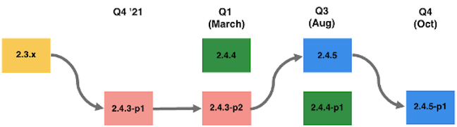
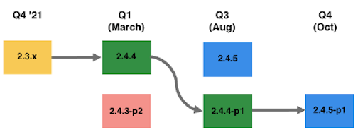
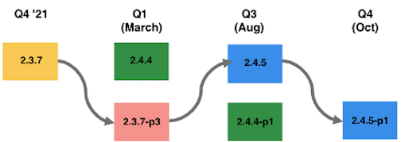
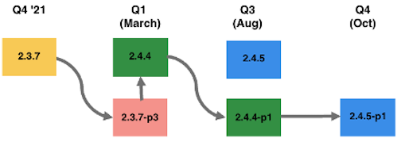
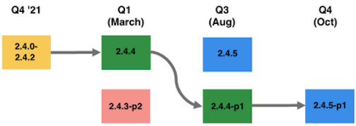
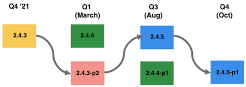

# Recommended upgrade paths for 2022

An eCommerce implementation is an evolution—it’s never truly finished. Your business must remain one step ahead of trends by introducing the latest capabilities and functionality that keeps your customers engaged. Over time, these additional capabilities increase the footprint and overall complexity of the implementation.

Some of the general factors that affect the level of effort needed for your upgrade project include, but are not limited to:

| Technical complexity                                      | Planning and strategy                                        |
|-----------------------------------------------------------|--------------------------------------------------------------|
| Extent of customizations                                  | Clarity of requirements, wavering decisions, and scope creep |
| Number of extensions                                      | Your upgrade frequency                                       |
| Number of integrations with third-parties (OMS, ERP) | Your testing strategy                                        |
| Coding to best practices                                  |                                                              |

The following are Adobe Commerce-recommended paths to keep your site secure and performant throughout 2022. 

## Upgrading from versions 2.3.0-2.3.6 (option 1)

You can go from any 2.3.x line to 2.4.3. However, the longer you go without an upgrade, the more effort it is to go directly to 2.4.3 as the code base changed more. 

For example, if you are on 2.3.4 that released in January 2020, you are on a release that is almost two years old so the code base of 2.4.3 when compared to 2.3.4 is far greater. This is why Adobe recommends that you upgrade often as the level of effort tends to be even higher if you delay your upgrade for a prolonged period.

Once you are on 2.4.3, then in Q1 you can continue to be secure by taking 2.4.3-p2, which is a low effort since it is a light security release. Then in Q3, you can take the full patch 2.4.5 and one more light security patch to stay secure in Q4. This path requires two high-effort upgrades by the end of 2022.

## Upgrading from versions 2.3.0-2.3.6 (option 2)

Alternatively, you can upgrade from 2.3.x directly to 2.4.4 in March 2022. From 2.4.4, you can then take the light security patch in Q3, then upgrade to the 2.4.5-p1 version in Q4, which includes all updates that were in the 2.4.5 release and additional security patches.

Key considerations when deciding between these two options:

| Option 1: Upgrade to 2.4.3-p1 or -p2                                                                               | Option 2: Upgrade to 2.4.4 or 2.4.4-p1                                                                                                           |
|--------------------------------------------------------------------------------------------------------------------|--------------------------------------------------------------------------------------------------------------------------------------------------|
| Requires 2 significant upgrades before the end of 2022 to remain secure, PCI compliant, and receive Quality Support | Requires 1 significant upgrade and 1 low-medium effort upgrade before the end of 2022 to remain secure, PCI-compliant, and receive Quality Support |
| Enables you to potentially get to a supported, PCI-compliant version sooner                                         | Potentially face a longer window until you get to a supported, PCI-compliant version, since the 2.3 line reaches EOL in April 2022                   |
| Timing consideration: can delay moving to a new PHP version until later in the year (August)                        | Timing consideration: can start moving to a new PHP version earlier in the year (March)                                                           |

## Upgrading from 2.3.7 (option 1)

As you are on the latest 2.3.7 release, you are on a line that is only getting security releases. In Q1 of ’22, Adobe is releasing the last release of 2.3, which is 2.3.7-p3, along with a security release (2.4.3-p2) and a full release (2.4.4).

Your first option would be to take the 2.3.7-p3 and get the latest security fixes. Then, in August, you could take the 2.4.5 release. Lastly, in Q4 you could take the light security release based on the full 2.4.5 release. In this scenario, you would be on an EOL version for a few months until you take 2.4.5. However, 2.3.x currently does not offer quality support and you would have the most recent security vulnerabilities patched.

## Upgrading from 2.3.7 (option 2)

Your second option would be taking the 2.3.7-p3 release to get the latest security fixes quickly, since security patches for your current line are a low effort to implement, then you can start the upgrade to 2.4.4. 

In August, you could then take 2.4.4-p1, which would be a light security release, then in Q4 take 2.4.5-p1, which includes all updates included in 2.4.5 and the latest security releases.

You can also go from 2.3.7-p3 to 2.4.4-p1, but note that the 2.4.4-p1 is a "heavy lift" since you are essentially getting all of the updates included in 2.4.4 and the security updates in 2.4.4-p1. Deciding whether you want to start this heavier lift to the 2.4.4 line in March or August is up to you and your team.

Key considerations when deciding between these two options:

| Option 1: Upgrade to 2.3.7-p3 then 2.4.5                                                                           | Option 2: Upgrade to 2.3.7-p3 then 2.4.4                                                                                                            |
|--------------------------------------------------------------------------------------------------------------------|-----------------------------------------------------------------------------------------------------------------------------------------------------|
| Receive the latest security updates with a low effort security patch first                                         | Receive the latest security updates with a low effort security patch first                                                                          |
| Requires 1 significant upgrade before the end of 2022 to remain secure, PCI-compliant, and receive Quality Support | Requires 1 significant upgrade and 1 low-medium effort upgrade before the end of 2022 to remain secure,  PCI-compliant, and receive Quality Support |
| Face a longer window until you get to a supported, PCI-compliant version as 2.3 line reaches EOL in April          | Timing consideration: can start moving to a new PHP version earlier in the year (March)                                                              |
| Timing considerations: can delay higher effort upgrade until August                                                | Timing considerations: can start higher effort upgrade in March, then take on a low-medium upgrade in October                                        |

## Upgrading from 2.4.0-2.4.2

Since you are on 2.4.0-2.4.2, we recommend that you upgrade to 2.4.4 in Q1. This is a relatively high effort due to the breaking changes in 2.4.4 caused by the move to PHP 8.1. However, the remainder of the upgrades for the year are lower efforts, so you only need to conduct one higher-level effort upgrade in 2022.

## Upgrading from 2.4.3 

 
Since you are on 2.4.3, taking 2.4.3-p2 in Q1 would be the least amount of effort. Then in August, you could take the 2.4.5 release. Lastly, in Q4 you could take the light security release based on the full 2.4.5 release. In this scenario, you only conduct one higher-level effort upgrade in 2022.
