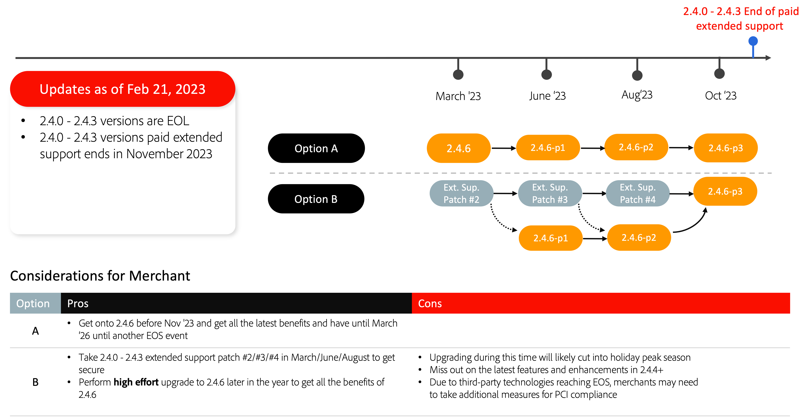

# Recommended upgrade paths

An eCommerce implementation is an evolution—it's never truly finished. Your business must remain one step ahead of trends by introducing the latest capabilities and functionality that keeps your customers engaged. Upgrading to the latest Adobe Commerce version enables you to stay ahead of the pack with best-in-class innovations and future-proof your business with:

- Faster access to innovative features delivered as SaaS services
- Easier and more cost-effective maintenance and upgrades
- Continued flexibility and customization to meet unique business needs
- Significant increases in performance and scalability
- Better developer experience and tooling
- Ability to more deeply integrate with other Adobe Experience Cloud applications

To provide our merchants with more flexibility when planning upgrades, we recently updated the Adobe Commerce [release schedule](../../release/schedule.md), extended the 2.3 End of Support (EOS) date, and announced new extended support options for select versions of our software. For more information on these updates, see [Expanded support for Adobe Commerce](https://business.adobe.com/blog/the-latest/adobe-announces-expanded-support).

The following are Adobe Commerce-recommended upgrade paths to keep your site secure and performant while upgrading to one of the latest versions.

## Upgrading from 2.3.7

## Upgrading from 2.4.0-2.4.3

## Upgrading from 2.4.4 and 2.4.5

