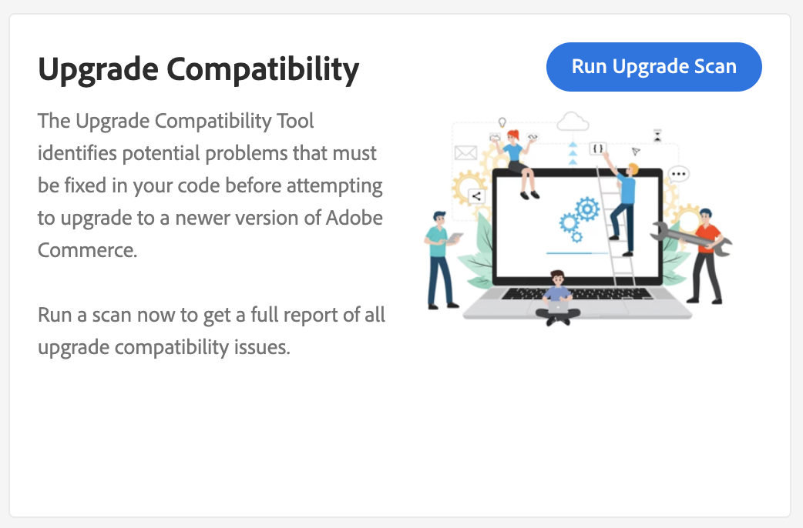
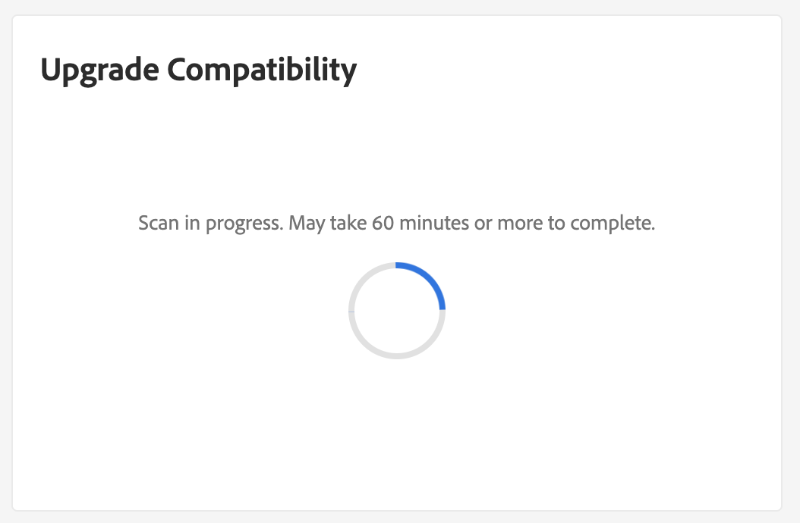
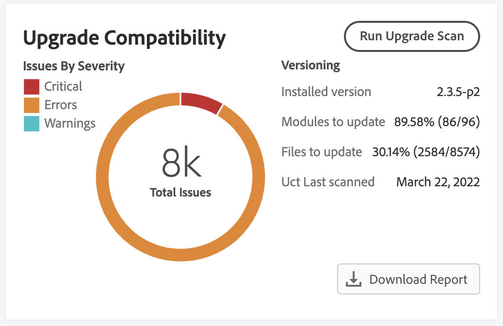

# Integrate the [!DNL Site-Wide Analysis Tool]

The [!DNL Site-Wide Analysis Tool] provides 24/7 real-time performance monitoring, reports, and recommendations to ensure the security and operability for Adobe Commerce instances.

The [!DNL Upgrade Compatibility Tool] is now integrated with the [!DNL Site-Wide Analysis Tool] in order to provide the ability for non-technical people to run the [!DNL Upgrade Compatibility Tool] and get a [report](../upgrade-compatibility-tool/reports.md) containing a list of issues for each file.

See the [[!DNL Site-Wide Analysis Tool] user guide](https://experienceleague.adobe.com/en/docs/commerce-operations/tools/site-wide-analysis-tool/access) for more information.

## Run the [!DNL Upgrade Compatibility Tool] from the [!DNL Site-Wide Analysis Tool]

Navigate to the [!DNL Site-Wide Analysis Tool] dashboard for your project and locate the [!DNL Upgrade Compatibility Tool] widget.

Click **[!UICONTROL Run Upgrade Scan]**. The scan can take some time depending on the project size. A spinner indicates that the scan is in progress.

After the scan is complete, the high level results are displayed in the widget.

Click **[!UICONTROL Download Report]** to retrieve the [!DNL Upgrade Compatibility Tool] [HTML report](../upgrade-compatibility-tool/reports.md#html-report) and review the details.

>[!NOTE]
>
> Running the [!DNL Upgrade Compatibility Tool] through the [!DNL Site-Wide Analysis Tool] optimizes your results and helps you focus on issues that are new and critical for your target upgrade. It uses the [`--ignore-current-version-compatibility-errors`](run.md#optimize-your-results) option and always shows results comparing your project's version with the latest released version.
