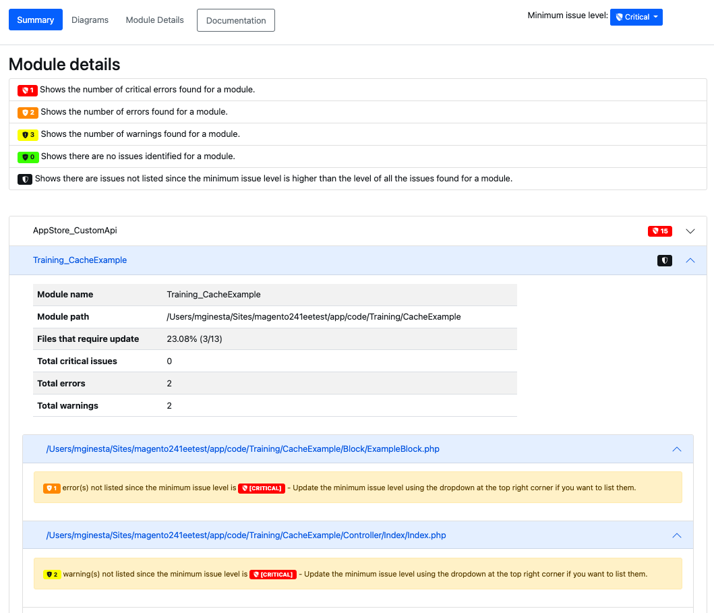
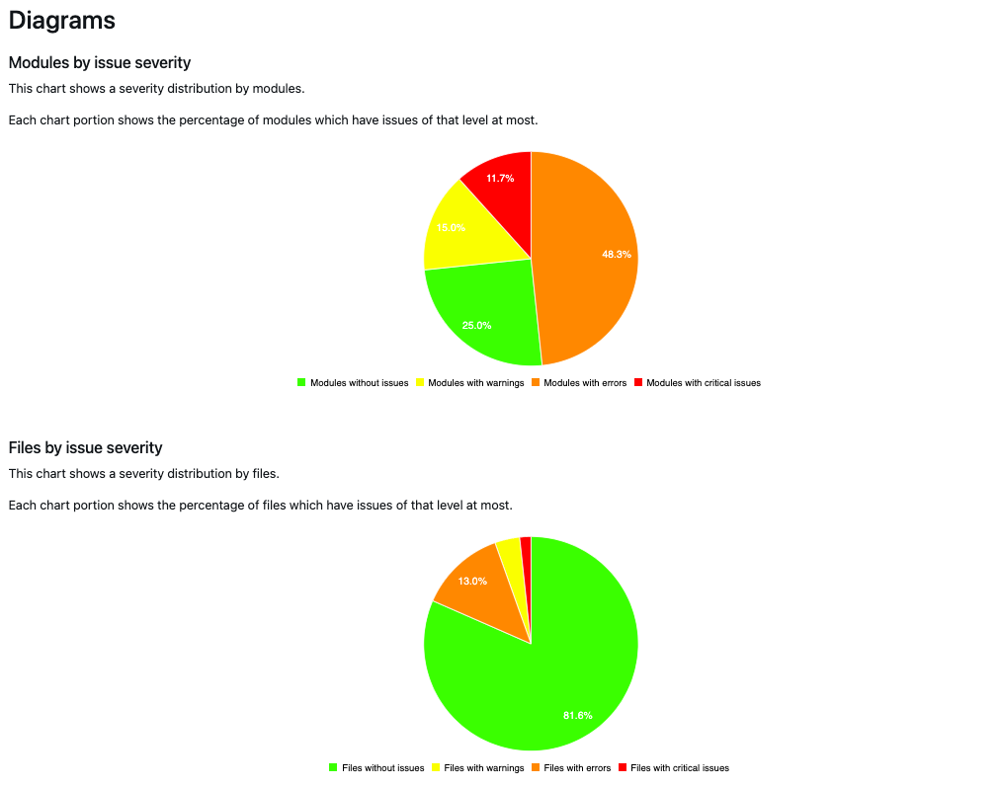
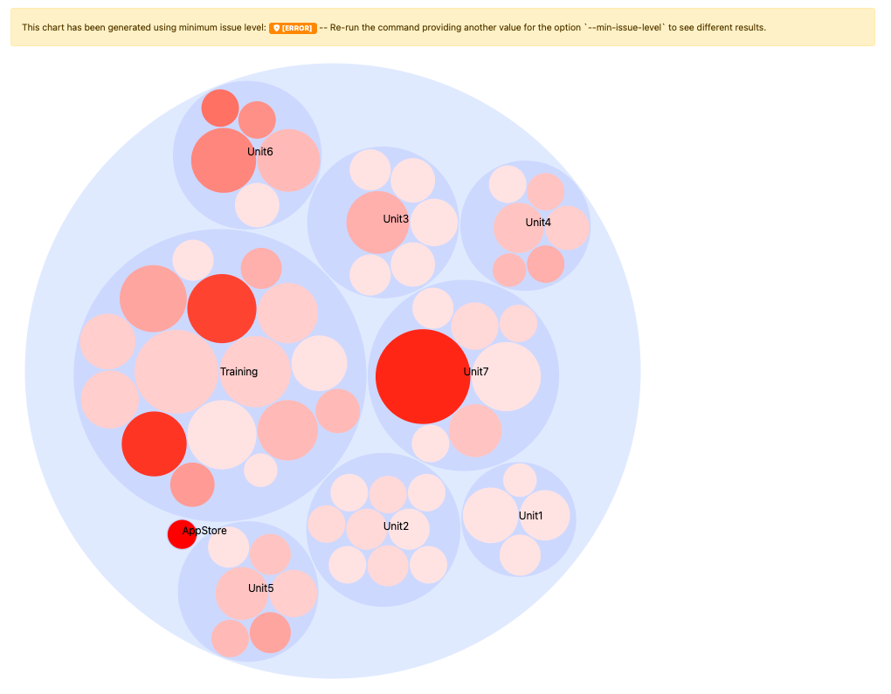

# Reports

{{commerce-only}}

As a result of the analysis, the [!DNL Upgrade Compatibility Tool] can export a report that contains a list of issues for each file specifying its severity, error code, and error description. The [!DNL Upgrade Compatibility Tool] exports the report into two different formats:

- A [JSON file](reports.md#json-file).
- An [HTML report](reports.md#html-report).

See the following command-line interface example of a report:

```
File: /app/code/Custom/CatalogExtension/Controller/Index/Index.php
------------------------------------------------------------------
 * [WARNING][1131] Line 10: Extending from class 'Magento\Framework\App\Action\Action' that is @deprecated on version '2.4.4'
 * [ERROR][1328] Line 10: Implemented interface 'Magento\Framework\App\Action\HttpGetActionInterface' that is non API on version '2.4.4'
```

Check the [Error message reference](../upgrade-compatibility-tool/error-messages.md) topic for more information on the different errors this report can produce.

This report also includes a detailed summary that shows:

- *Current version*: the version currently installed.
- *Target Version*: the version you want to upgrade to.
- *Execution time*: the amount of time the analysis took to build the report (mm:ss).
- *Modules that require update*: the percentage of modules that contain compatibility issues and require update.
- *Files that require update*: the percentage of files that contain compatibility issues and require update.
- *Total critical errors*: the number of critical errors found.
- *Total errors*: the number of errors found.
- *Total warnings*: the number of warnings found.
- *Memory peak usage*: the maximum amount of memory the [!DNL Upgrade Compatibility Tool] has reached during execution.

See the following command-line interface example:

```
 ----------------------------- ----------------- 
  Current version               2.4.1            
  Target version                2.4.4            
  Execution time                1m:8s            
  Modules that require update   71.67% (43/60)   
  Files that require update     18.05% (96/532)  
  Total critical issues         24               
  Total errors                  159              
  Total warnings                53               
  Memory peak usage             902.00 MB        
 ----------------------------- ----------------- 
```

## JSON file

You can get the JSON file output while running the [!DNL Upgrade Compatibility Tool] on a command-line interface. The `JSON` file contains exactly the same information shown on the [!DNL Upgrade Compatibility Tool] output:

- A list of identified issues.
- A summary of the analysis.

For each encountered issue, the report provides detailed information such as the severity and description of the problem.

To export this `JSON` file into a different output folder:

```bash
bin/uct upgrade:check <dir> --json-output-path[=JSON-OUTPUT-PATH]
```

Where arguments are as follows:

- `<dir>`: Adobe Commerce installation directory.
- `[=JSON-OUTPUT-PATH]`: Path directory to export the `JSON` output file.

>[!NOTE]
>
> The default path for the output folder is `var/output/[TIME]-results.json`.

## HTML report

You can get the HTML report while running the tool on a command-line interface or through the [!DNL Site-Wide Analysis Tool]. The HTML report also contains:

- A list of identified issues.
- A summary of the analysis.


You can easily navigate through the identified issues during the [!DNL Upgrade Compatibility Tool] analysis.

You can filter issues shown on the report according to the minimum issue level (default value is `WARNING`).

There is a dropdown at the top-right corner that allows you to select a different level. The list of identified issues is filtered accordingly.



>[!NOTE]
>
> The issues with lower issue level are stripped out but you get a notification so you are always aware of the identified issues per module. 

The HTML report also includes four different charts:

- **Modules by issue severity**: Shows severity distribution by modules.
- **Files by issue severity**: Shows severity distribution by files.
- **Modules ordered by total number of issues**: Shows the 10 most compromised modules taking into account warnings, errors, and critical errors.
- **Modules with relative sizes and issues**: The more files a module contains, the bigger its circle. The more issues a module has, the more red its circle appears.

These charts allow you to identify the modules that are most compromised and the ones that require more work to perform an upgrade.



The HTML report diagrams are also updated accordingly, with the only exception of the `Modules with relative sizes and issues`, which is generated with the `min-issue-level` that was orginally set up. 

If you want to see different results for the `Modules with relative sizes and issues` diagram, you must re-run the command providing another value for the `--min-issue-level` option.



To export this HTML report into a different output folder:

```bash
bin/uct upgrade:check <dir> --html-output-path[=HTML-OUTPUT-PATH]
```

Where arguments are as follows:

- `<dir>`: Adobe Commerce installation directory.
- `[=HTML-OUTPUT-PATH]`: Path directory to export the `.html` output file.

>[!NOTE]
>
> The default path for the output folder is `var/output/[TIME]-results.html`.
