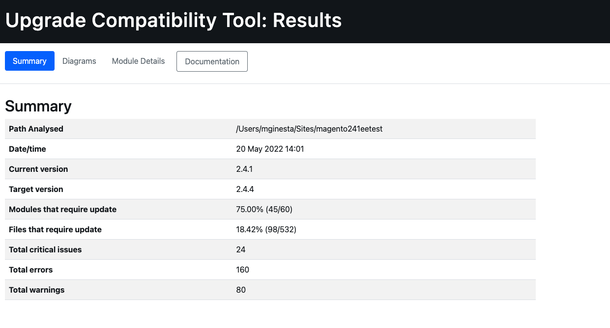
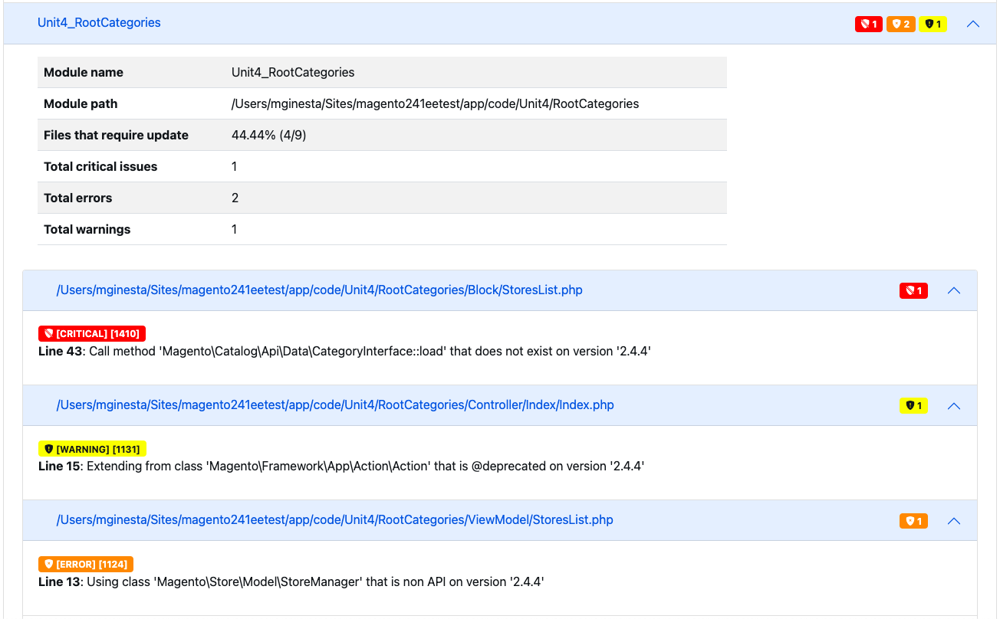

# Run the [!DNL Upgrade Compatibility Tool]

{{commerce-only}}

The [!DNL Upgrade Compatibility Tool] is a command-line tool that checks an Adobe Commerce customized instance against a specific version by analyzing all modules installed in it. It returns a list of critical issues, errors, and warnings that must be addressed before upgrading to the latest version of Adobe Commerce.

The [!DNL Upgrade Compatibility Tool] identifies potential problems that must be fixed in your code before attempting to upgrade to a newer version of Adobe Commerce.

## Use the `upgrade:check` command

The `upgrade:check` command is the main command to execute the tool:

```bash
bin/uct upgrade:check <dir>
```

>[!TIP]
>
>The `<dir>` value is the directory where your Adobe Commerce instance is located.

The `upgrade:check` command runs the [!DNL Upgrade Compatibility Tool] and checks an Adobe Commerce customized instance against a specific version by analyzing all modules installed in it. It returns a list of critical issues, errors, and warnings that must be addressed before upgrading to the latest version of your Adobe Commerce.

>[!WARNING]
>
>Execute only when the project root (or main) directory is provided.

This command checks for core code changes for that specific Adobe Commerce instance, and all custom code changes installed in it.

You can run the `core:code:changes` command to analyze only core code changes for that specific Adobe Commerce instance. See [Core code changes](../upgrade-compatibility-tool/run.md#use-the-core:code:changes-command) section.

While you can use the `graphql:compare` command to compare two GraphQL schemas to check for any changes between them. See [GraphQL schema compatibility verification](../upgrade-compatibility-tool/run.md#graphql-schema-compatibility-verification) section.

### Recommendations to use the `upgrade:check` command

- The [!DNL Upgrade Compatibility Tool] requires at least 2GB RAM to run. This setting is recommended to avoid issues due to a low memory limitation. The [!DNL Upgrade Compatibility Tool] displays a question if you run the `upgrade:check` command with a low `memory_limit` setting.
- Specify the `-m` option to run the tool against a specific module:

   ```bash
   bin/uct upgrade:check <dir> -m[=MODULE-PATH]
   ```

Where arguments are as follows:

- `<dir>`: Adobe Commerce installation directory.
- `[=MODULE-PATH]`: Specific module path directory.

### Use the `--help` option

To see the [!DNL Upgrade Compatibility Tool] command general options and help, run:

```bash
bin/uct --help
```

However, it is possible to run `--help` as an option when running a specific command, like `bin/uct upgrade:check`. This returns specific `--help` options for that command:

```bash
bin/uct upgrade:check --help
```

Available `--help` options for the `upgrade:check` command:

- `-m, --module-path[=MODULE-PATH]`: Path of the modules to be analysed
- `-a, --current-version[=CURRENT-VERSION]`: Current Adobe Commerce version, version of the Adobe Commerce installation will be used if omitted.
- `-c, --coming-version[=COMING-VERSION]`: Target Adobe Commerce version, version of the Adobe Commerce installation will be used if omitted.
- `--json-output-path[=JSON-OUTPUT-PATH]`: Path of the file where the output will be exported in json format.
- `--html-output-path[=HTML-OUTPUT-PATH]`: Path of the file where the output will be exported in HTML format.
- `--min-issue-level`: Minimum issue level to show in report. Default is [WARNING].
- `--ignore-current-version-compatibility-issues`: Use this option when you do not want to include known critical issues, errors and warnings in your [!DNL Upgrade Compatibility Tool] report.
- `--context=CONTEXT`: Execution context. This option is for integration purposes and does not affect the execution result.
- `-h, --help`: Display help for that specific command. If no command is provided, `list` command is the default result.
- `-q, --quiet`: Do not output any messages while executing the command.
- `-v, --version`: Display application version.
- `--ansi, --no-ansi`: Enable ANSI output.
- `-n, --no-interaction`: Do not ask any interactive question while executing the command.
- `-v, --vv, --vvv, --verbose`: Increase verbosity of output communications. 1 for normal output, 2 for verbose output, and 3 for DEBUG output.

### Output

As a result of the analysis performed, the [!DNL Upgrade Compatibility Tool] exports a report that contains a list of issues for each file specifying its severity, error code and error description.

See the example below:

```terminal
File: /app/code/Custom/CatalogExtension/Controller/Index/Index.php
------------------------------------------------------------------
 * [WARNING][1131] Line 23: Extending from class 'Magento\Framework\App\Action\Action' that is @deprecated on version '2.4.2'
 * [ERROR][1429] Line 103: Call method 'Magento\Framework\Api\SearchCriteriaBuilder::addFilters' that is non API on version '2.4.2'
 * [CRITICAL][1110] Line 60: Instantiating class/interface 'Magento\Catalog\Model\ProductRepository' that does not exist on version '2.4.2'
```

Check the [Error message reference](error-messages.md) topic for more information.

The report also includes a detailed summary that shows:

- *Current version*: the version currently installed.
- *Target Version*: the version you want to upgrade to.
- *Execution time*: the amount of time the analysis took to build the report (mm:ss).
- *Modules that require update*: the percentage of modules that contain compatibility issues and require update.
- *Files that require update*: the percentage of files that contain compatibility issues and require update.
- *Total critical errors*: the number of critical errors found.
- *Total errors*: the number of errors found.
- *Total warnings*: the number of warnings found.

See the example below:

```terminal
 ----------------------------- ------------------
  Current version               2.4.2
  Target version                2.4.3
  Execution time                1m:10s
  Modules that require update   78.33% (47/60)
  Files that require update     21.62% (115/532)
  Total critical issues         35
  Total errors                  201
  Total warnings                103
 ----------------------------- ------------------
```

>[!NOTE]
>
>By default, the [!DNL Upgrade Compatibility Tool] exports the report into 2 different formats: `json` and `html`.

#### JSON

The JSON file contains exactly the same information shown on output:

- List of the identified issues.
- Summary of the analysis.

For each encountered issue, the report provides detailed information such as the severity and description of the problem.

>[!NOTE]
>
>The default path for the output folder is `var/output/[TIME]-results.json`.

To export this report into a different output folder, run:

```bash
bin/uct upgrade:check <dir> --json-output-path[=JSON-OUTPUT-PATH]
```

Where arguments are as follows:

- `<dir>`: Adobe Commerce installation directory.
- `[=JSON-OUTPUT-PATH]`: Path directory to export the `.json` output file.

>[!NOTE]
>
>The default path for the output folder is `var/output/[TIME]-results.json`.

#### HTML

The HTML file also contains the list of identified issues and analysis summary. It also includes four different charts:

- **Modules by issue severity**: Shows severity distribution by modules.
- **Files by issue severity**: Shows severity distribution by files.
- **Modules ordered by total number of issues**: Shows the 10 most compromised modules taking into account warnings, errors, and critical errors.
- **Modules with relative sizes and issues**: The more files a module contains, the bigger its circle. The more issues a module has, the more red its circle appears.

These charts allow you to identify (at a glance) the parts that are most compromised and the ones that require more work to perform an upgrade.





To export this report into a different output folder run:

```bash
bin/uct upgrade:check <dir> --html-output-path[=HTML-OUTPUT-PATH]
```

Where arguments are as follows:

- `<dir>`: {{site.data.var.ee}} installation directory.
- `[=HTML-OUTPUT-PATH]`: Path directory to export the `.html` output file.

>[!NOTE]
>
>The default path for the output folder is `var/output/[TIME]-results.html`.

### Use the `--ignore-current-version-compatibility-issues` option

The [!DNL Upgrade Compatibility Tool] allows you to run the `upgrade:check` command with an `--ignore-current-version-compatibility-issues` option, so it only shows new or unknown critical issues, errors, and warnings. Use this option when you do not want to include known critical issues, errors and warnings in your [!DNL Upgrade Compatibility Tool] report.

```bash
bin/uct upgrade:check --ignore-current-version-compatibility-issues <dir>
```

>[!NOTE]
>
>This applies only to PHP API validations.

### Vanilla installation

A _vanilla_ installation is a clean installation of a specified version tag or branch for a specific release version.

The `bin/uct core:code:changes` command checks if there is a vanilla instance in your system. If this is the first time using a vanilla installation, an interactive command-line question prompts you to download the vanilla project from the [Adobe Commerce repository](https://repo.magento.com/).

You can run an [!DNL Upgrade Compatibility Tool] command with the `--vanilla-dir` option to specify the Adobe Commerce vanilla installation directory.

See the [Deploy vanilla instance](https://devdocs.magento.com/contributor-guide/contributing.html#vanilla-pr) topic for more information.

## Use the `list` command

To return a list of the [!DNL Upgrade Compatibility Tool] available commands, run:

```bash
bin/uct list
```

The `list` command returns the following:

- `-h, --help`: Display help for that specific command. If no command is provided, `list` command is the default result.
- `-q, --quiet`: Do not output any messages while executing the command.
- `-v, --version`: Display app version.
- `--ansi, --no-ansi`: Enable ANSI output.
- `-n, --no-interaction`: Do not ask any interactive question while executing the command.
- `-v, --vv, --vvv, --verbose`: Increase verbosity of output communications. 1 for normal output, 2 for verbose output, and 3 for DEBUG output.

## Use the `core:code:changes` command

You can compare your current Adobe Commerce installation with a clean vanilla installation to see if the core code has any modifications made to implement a new feature or customization. This validation helps estimate the effort that the upgrade requires based on those changes.

```bash
bin/uct core:code:changes <dir> <vanilla dir>
```

Where arguments are as follows:

- `<dir>`: Adobe Commerce installation directory.
- `<vanilla dir>`: Adobe Commerce vanilla installation directory.

There are some limitations when running this command:

- Execute only when the project root (or main) directory is provided.
- Shows a list of core modifications only.

### Use the `core:code:changes` command  with the `--help` option

Available `--help` options for the `core:code:changes` command:

- `-h, --help`: Display help for that specific command. If no command is provided, `list` command is the default result.
- `-q, --quiet`: Do not output any messages while executing the command.
- `-v, --version`: Display app version.
- `--ansi, --no-ansi`: Enable ANSI output.
- `-n, --no-interaction`: Do not ask any interactive question while executing the command.
- `-v, --vv, --vvv, --verbose`: Increase verbosity of output communications. 1 for normal output, 2 for verbose output, and 3 for DEBUG output.

## Version

You can compare your current Adobe Commerce installation with Adobe Commerce versions `>=2.3`.

You must provide the version as a parameter when running the command:

```bash
bin/uct upgrade:check <dir> -c 2.4.3
```

Where:

- `-c, --coming-version[=COMING-VERSION]`: The Adobe Commerce targeted version.

There are some limitations when running the previous command:

- This parameter refers to any tag that identifies a specific version of Adobe Commerce.
- It is a requirement to provide this one explicitly; providing only the value of it does not work.
- Provide the tag version without any quotation marks (neither single nor double): ~~'2.4.1-develop'~~.
- You should NOT provide older versions than the one you have currently installed, nor older than 2.3, which is the oldest one supported at the moment.

## GraphQL schema compatibility verification

The [!DNL Upgrade Compatibility Tool] also provides the option to introspect two GraphQL endpoints and compare their schemas looking for breaking and dangerous changes between them:

```bash
bin/uct graphql:compare <schema1> <schema2>
```

Where arguments are as follows:

- `<schema1>`: Endpoint URL for the existing installation.
- `<schema2>`: Endpoint URL for the vanilla installation.

You must have running `instance before` and `instance after` the upgrade.

### GraphQL compare command `--help` options

Available `--help` options for the `graphql:compare` command:

- `-h, --help`: Display help for that specific command. If no command is provided, `list` command is the default result.
- `-q, --quiet`: Do not output any messages while executing the command.
- `-v, --version`: Display app version.
- `--ansi, --no-ansi`: Enable ANSI output.
- `-n, --no-interaction`: Do not ask any interactive question while executing the command.
- `-v, --vv, --vvv, --verbose`: Increase verbosity of output communications. 1 for normal output, 2 for verbose output, and 3 for DEBUG output.

### Example with a list of critical issues, errors, and warnings for GraphQL

```terminal
 *   [WARNING] FIELD_CHANGED_KIND: ConfigurableProduct.gender changed type from Int to String.
 *   [WARNING] OPTIONAL_INPUT_FIELD_ADDED: An optional field sku on input type ProductAttributeSortInput was added.
```

See [Developer information](../upgrade-compatibility-tool/developer.md) for more information.

You can run the [!DNL Upgrade Compatibility Tool] with a run configuration via the PhpStorm plugin. See the [[!DNL Upgrade Compatibility Tool] Run Configuration](https://devdocs.magento.com/guides/v2.3/ext-best-practices/phpstorm/uct-run-configuration.html) topic for more information.

## Troubleshooting

### Empty output

>[!NOTE]
>
>The `M2_VERSION` is the target Adobe Commerce version you want to compare to your Adobe Commerce instance.

If after running this command:

```bash
bin/uct upgrade:check INSTALLATION_DIR -c M2_VERSION
```

The only output is `Upgrade compatibility tool`:

```terminal
bin/uct upgrade:check /var/www/project/magento/ -c 2.4.1
Upgrade compatibility tool
```

The likely cause is a PHP memory limitation.
Override the memory limitation by setting `memory_limit` to `-1`:

```bash
php -d memory_limit=-1 /bin/uct upgrade:check INSTALLATION_DIR -c M2_VERSION
```
